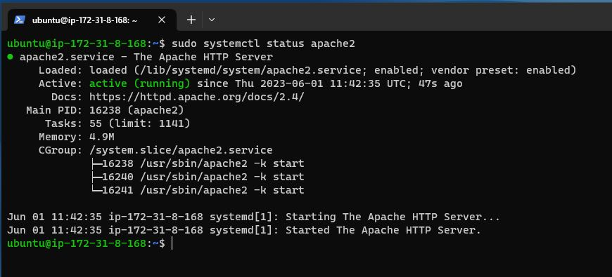

# WEB STACK IMPLEMENTATION (LAMP STACK) IN AWS

## What is a Web Stack?
A web stack or Web application stack is a complilation of software set up especially for implementing websites and web applications. The term 'STACK' refers to the fact that the system's individual components are built upon one another. The basic requirements necessary to construct a web stack include: an operating system, a webserver, a database, and a script interpreter. 

Given that a web stack's distint software components can be individually combined, there are numerous variations possible that can be used for many different application cases. Some examples include:
- LAMP (Linux, Apache, MySQL, PHP or Python or Perl)
- LEMP (Linux, Nginx, MySQL, PHP 0r Python or Perl) 
- MERN (MongoDB, ExpressJS, ReactJS, NodeJS)
- MEAN (MongoDB, ExpressJS, AngularJS, NodeJS)

[Culled from https://www.ionos.com](https://www.ionos.com/digitalguide/server/know-how/web-stacks-the-basics-and-examples/)

<!-- Horizontal Rule -->
---

<!-- Strong -->
**On this project we will be implementing the LAMP STACK.**

<!-- Horizontal Rule -->
---

### STEP  0 - Preparing Prerequisites

In order to complete this project you will need an AWS account and a virtual server with Ubuntu Server Operating System running on it.

- [AWS account setup and Provisioning an Ubuntu Server](https://www.youtube.com/watch?v=xxKuB9kJoYM&list=PLtPuNR8I4TvkwU7Zu0l0G_uwtSUXLckvh&index=8)

- [Connecting to your EC2 Instance](https://www.youtube.com/watch?v=TxT6PNJts-s&list=PLtPuNR8I4TvkwU7Zu0l0G_uwtSUXLckvh&index=9)

### STEP 1 - Installing Apache and Updating the Firewall

<!-- Github Markdown -->

<!-- Code Blocks -->
```
#update a list of packages in package manager
sudo apt update && sudo apt upgrade -y

#run apache2 package installation
sudo apt install apache2 -y

#verify that apache2 is running as a service
sudo systemctl status apache2
```




- Access your web server locally in your Ubuntu shell, run:
<!-- Code Blocks -->
```
curl http://localhost:80
or
curl http://127.0.0.1:80
```


- You can also access the apache website using the following url:
<!-- Code Blocks -->
```
http://<Public-IP-Address>:80
```


### STEP 2 - Installing MySQL
<!-- Code Blocks -->
```
# install MySQL server
sudo apt install mysql-server -y


#see the status of Mysql
sudo systemctl status mysql


# Log into the MySQL console as administrative database root user
sudo mysql


# Changing the password for the root user
mysql> ALTER USER 'root'@'localhost' IDENTIFIED WITH mysql_native_password BY 'Password.1';


mysql> flush privileges;


mysql> exit
```


* Start the interactive script by running:
<!-- Code Blocks -->
```
sudo mysql_secure_installation
```


<!-- Blockquote -->
> Enabling this feature is something of a judgment call. If enabled, passwords which do not match the specified standard will be rejected with an error by MySQL. It is safe to leave the vaildation disabled but you should always use strong, unqiue passwords for database credentials.

> Every other prompts can be answered with 'y' for YES 

* Test that you can log into your MySQL console by running:
<!-- Code Block -->
```
sudo mysql -p
Enter password:
```


- You will be requested to enter your password to log in.

- To exit the MySQL console, type:
<!-- Code Block -->
```
mysql> exit
```


### STEP 3 - Installing PHP
PHP is the component of our setup that will process code to display dynamic content to the end user. The PHP package you'll need are `php-mysql`, a php module that allows PHP to communicate with MySQL-bases databases. You'll need `libapache2-mod-php` to enable Apache to handle PHP files. Core PHP packages will automatically be installed as dependencies.

<!-- Code Block -->
```
sudo apt install php libapache2-mod-php php-mysql -y

# To confirm your php version, run
 php -v
```


### STEP 4 - Creating a Virtual Host for your Website using Apache

In this project, we will set up a domain called `projectlamp`  .

Apache on Ubuntu has one server block enabled by default that is configured to serve documents from the `/var/www/html` directory.
We wish to use a different directory for our project by creating a new directory named `projectlamp`
<!-- Code Block -->
```
sudo mkdir /var/www/projectlamp
```


* Assign ownership of the directory with your current system user
<!-- Code Block -->
```
sudo chown -R $USER:$USER /var/www/projectlamp
```
* Create and open a new configuration file in Apache's site-available directory using your prefered editior
<!-- Code Block -->
```
sudo vi /etc/apache2/sites-available/projectslamp.conf

<VirtualHost *:80>
    ServerName projectlamp
    ServerAlias www.projectlamp
    ServerAdmin webmaster@localhost
    DocumentRoot /var/www/projectlamp
    ErrorLog ${APACHE_LOG_DIR}/error.log
    CustomLog ${APACHE_LOG_DIR}/access.log
    combined
</VirtualHost>
```


* use the ls command to show the new file in the sites-available directory.


* Use the a2ensite command to enable the new virtual host.
<!-- Code Block -->
```
sudo a2ensite projectlamp
```

* You might want to disable the default wedsite that comes installed with Apache. This becomes necessary if you are not using the custom domain name, because in this case Apache's default configuration will overwrite your vitual host.

To disable Apache's default website type:
<!-- Code Block -->
```
sudo a2dissite 000-default

# Make sure your configuration file does not contain syntax errors, run

sudo apache2ctl configtest

# reload the Apache server so that changes can be effected.

sudo systemctl reload apache2
```


* Your new website is now active but the web root /var/www/projectlamp is stil empty.
* Create an index.html file in that location so that we can test that the virtual host works as expected.
* Run the commands below:
<!-- Code Build -->
```
sudo echo 'Hello LAMP from hostname '$(curl -s http://169.254.169.254/latest/meta-data/public-hostname) 'With Public IP' $(curl -s http://169.254.169.254/latest/meta-data/public-ipv4) > /var/www/projectlamp/index.html


#Open website URL in your broswer

http://<Public-IP-Address>:80
```


* You should find something like on your browser


### STEP 5 - Enable PHP on the Website

With the default DirectoryIndex settings on Apache, a file named index.html will always take precedence over an index.php file. This is useful for setting up maintenance pages in PHP applications, by creating a temporary index.html file containing an informative message to visitors. Because this page will take precedence over the index.php page, it will then become the landing page for the application. Once maintenance is over, the index.html is renamed or removed from the document root, bringing back the regular application page

- In case you want to change this behavior, you’ll need to edit the /etc/apache2/mods-enabled/dir.conf file and change the order in which the index.php file is listed   within the DirectoryIndex directive:
<!-- Code Block -->
```
sudo vim /etc/apache2/mods-enabled/dir.conf


<IfModule mod_dir.c>
        #Change this:
        #DirectoryIndex index.html index.cgi index.pl index.php index.xhtml index.htm
        #To this:
        DirectoryIndex index.php index.html index.cgi index.pl index.xhtml index.htm

</IfModule>
```


* You will need to reload Apache so that the chnges can be reflected
<!--Code Block -->
```
sudo systemctl reload apache2
```


 Create a new file named index.php inside your custom web root folder:
<!-- Code Block -->
```
sudo  vim /var/www/projectlamp/index.php


#Paste and save the text below:

<?php
phpinfo();

```  


- Refresh your web page, you should see something like this below:


- The above contains sensitive information about your environment. To remove it run the command below:

<!-- Code Block -->
```
sudo rm /var/www/projectlamp/index.php
```


