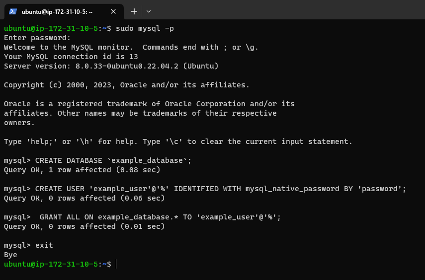
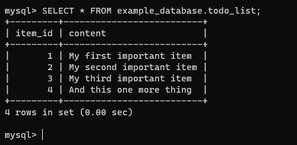

# PROJECT  2

## WEB STACK IMPEMENTATION - LEMP (Linux | Nginx | MySQL | PHP)

### Introduction
The LEMP software stack is a group of software that can be used to serve dynamic web pages and web applications written in PHP. This is an acronym that describes a Linux operating system, with an Nginx (pronounced like “Engine-X”) web server. The backend data is stored in the MySQL database and the dynamic processing is handled by PHP.

This project will install a LEMP stack on an Ubuntu 22.04 server. The Ubuntu operating system takes care of the Linux portion of the stack. 

To complete this project, you will need access to an Ubuntu 22.04 server as a regular, non-root sudo user, open TCP port 80 and port 22 so web browsers can access web pages and SSH can gain access.

### STEP 1 - INSTALLING THE NGINX WEB SERVER

To display web pages to site visitors, you’re going to employ Nginx, a high-performance web server. You’ll use the APT package manager to obtain this software.

Since this is your first time using apt for this session, start off by updating your server’s package index after wish you run the nginx install command.

<!-- Code Block -->
```
sudo apt update -y

sudo apt install nginx -y

sudo systemctl status nginx
```


Lets try to check how we can access the nginx server in our Ubuntu shell:

```
curl http://localhost:80
```


Now we can test how our Nginx server can respond to respond to request from the internet. Open a web broswer and try to access the following url:

```
http://<Public-IP-Address>:80
```
You should see something like this on your screen.


### STEP 2 - INSTALLING MYSQL

You need to install the database system to store and manage data for your site. MySQL is a popular database mamangement system used within PHP environments.

To install MySQL, run:
```
sudo apt install mysql-server -y
```


After the installation is complete, run the command to set your root password.

```
sudo mysql

mysql> ALTER USER 'root'@'localhost' IDENTIFIED WITH mysql_native_password BY 'PassWord.1';

mysql> flush privileges;

mysql> exit
```


Start the interactive script by runnning:
```
sudo mysql_secure_installation
```


Test that you can log into your MySQL console again
```
sudo mysql -p
Enter password:

mysql> exit
```


### STEP 3 - INSTALLING PHP

Install the PHP fastCGI process manager and PHP-MySQL module.

```
sudo apt install php-fpm php-mysql -y
```


### STEP 4 - CONFIGURING NGINX TO USE PHP PROCESSOR

When using the Nginx web server, we can create server blocks (similar to virtual hosts in Apache) to encapsulate configuration details and host more than one domain on a single server. In this PROJECT we will use projectLEMP as our domain name.

Create the root web directory for projectLEMP as follows:

```
sudo mkdir /var/www/projectLEMP
```


Assign ownership of the directory with the $USER environment variable which will reference your current system user.

```
sudo chown -R $USER:$USER /var/www/projectLEMP
```


Open a new configuration file in Nginx's `sites-available` directory using nano command-line editor.

```
sudo nano /etc/nginx/sites-available/projectLEMP
```


Paste the following bare-bones configuration:

```
#/etc/nginx/sites-available/projectLEMP

server {
    listen 80;
    server_name projectLEMP www.projectLEMP;
    root /var/www/projectLEMP;

    index index.html index.htm index.php;

    location / {
        try_files $uri $uri/ =404;
    }

    location ~ \.php$ {
        include snippets/fastcgi-php.conf;
        fastcgi_pass unix:/var/run/php/php8.1-fpm.sock;
     }

    location ~ /\.ht {
        deny all;
    }

}

```


Activate your configuration by linking to the config file from Nginx's `sites-enabled` directory.

```
sudo ln -s /etc/nginx/sites-available/projectLEMP /etc/nginx/sites-enabled/
```


Test your configuration for syntax errors by typing:

```
sudo nginx -t
```


Disable the default Nginx host that is currently configured to listen on port 80, for this run:

````
sudo unlink /etc/nginx/sites-enabled/default
````


Reload Nginx to apply the changes that have been made.

```
sudo systemctl reload nginx
```


Your new website is now active, but the web root `/var/www/projectLEMP` is still empty. Create an index.html file in that location so that we can test that your new server block works as expected:

```
sudo echo 'Hello LEMP from hostname' $(curl -s http://169.254.169.254/latest/meta-data/public-hostname) 'with public IP' $(curl -s http://169.254.169.254/latest/meta-data/public-ipv4) > /var/www/projectLEMP/index.html

```


Now go to your browser and try to open your website URL using IP address:

```
http://<Public-IP-Address>:80
```

This should be your display


### STEP 5 - TESTING PHP WITH NGINX

Your LEMP stack should now be completely set up.
At this point, your LAMP stack is completely installed and fully operational.

You can test it to validate that Nginx can correctly hand .php files off to your PHP processor.
You can do this by creating a test PHP file in your document root. 

Open a new file called info.php within your document root in your text editor:

```
sudo nano /var/www/projectLEMP/info.php

```


Type the following lines into the new file. This is valid PHP code that will return information about your server:

```
<?php
phpinfo();
```


You can now access this page in your web browser by visiting the domain name or public IP address you’ve set up in your Nginx configuration file, followed by `/info.php` :

```
http://server_domain_or_IP/info.php

```


### RETRIEVING DATA FROM MYSQL DATABASE WITH PHP

Connect to your MySQL console using the root account.

```
sudo mysql -p
```
Create a new database from your MySQL server console.

```
mysql> CREATE DATABASE `example_database`;

```

Create a new user and grant the user full privileges on the just created database

```
mysql>  CREATE USER 'example_user'@'%' IDENTIFIED WITH mysql_native_password BY 'password';
```

Give the user permission over the example_database.

```
mysql> GRANT ALL ON example_database.* TO 'example_user'@'%';
```
Now exit the MySQL shell with:

```
mysql> exit
```



You can test if the new user has the proper permissions by logging in to the MySQL console again, this time using the custom user credentials:

```
mysql -u example_user -p

```

After logging in to the MySQL console, confirm that you have access to the example_database database:

```
mysql> SHOW DATABASES;
```


Next, we’ll create a test table named todo_list. From the MySQL console, run the following statement:

```
CREATE TABLE example_database.todo_list (item_id INT AUTO_INCREMENT,content VARCHAR(255),PRIMARY KEY(item_id));
```


Insert a few rows of content in the test table. You may want to repeat the next command a few times using different values:

```
mysql> INSERT INTO example_database.todo_list (content) VALUES ("My first important item");
```


Confirm that the data was successfully saved to your table, run:

```
mysql>  SELECT * FROM example_database.todo_list;
```



Now you can create a PHP script that will connect to MySQL and query for your content. Create a new PHP file in your custom web root directory using Vi editor.

```
nano /var/www/projectLEMP/todo_list.php
```


```
<?php
$user = "example_user";
$password = "password";
$database = "example_database";
$table = "todo_list";

try {
  $db = new PDO("mysql:host=localhost;dbname=$database", $user, $password);
  echo "<h2>TODO</h2><ol>";
  foreach($db->query("SELECT content FROM $table") as $row) {
    echo "<li>" . $row['content'] . "</li>";
  }
  echo "</ol>";
} catch (PDOException $e) {
    print "Error!: " . $e->getMessage() . "<br/>";
    die();
}

```
Save and close the file when you are done editing.


You can now access this page in your web browser by visiting the domain name or public IP address configured for your website, followed by /todo_list.php:

```
http://<Public_domain_or_IP>/todo_list.php
```


