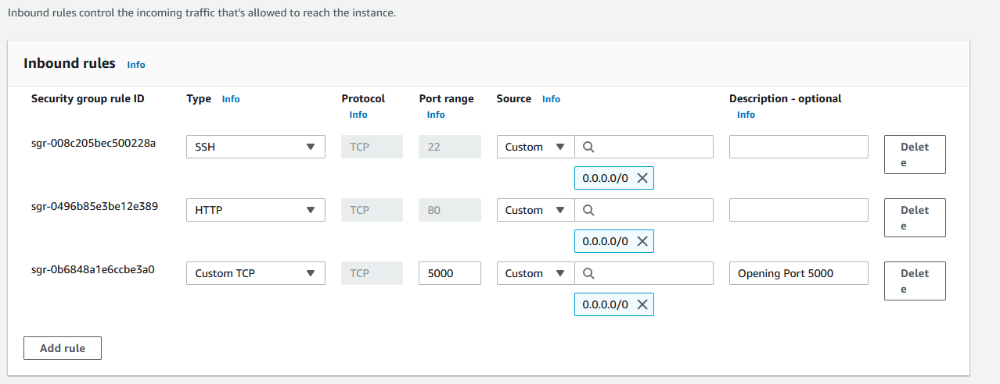
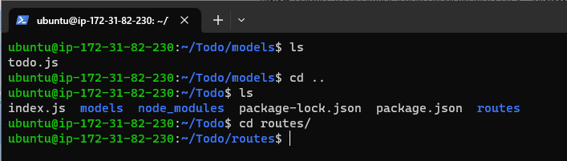
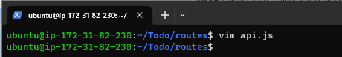
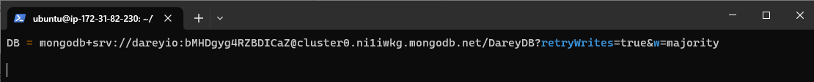

# **SIMPLE TO-DO APPLICATION ON A MERN WEB STACK**

In this this project we shall be tasked with implementing a web solution based on the MERN STACK in AWS Cloud.

MERN Stack is a collection of four different technologies that function together to build dynamic web apps and websites.

The MERN web stack consist of the following technologies:

* M - MongoDB
* E - ExpressJS
* R - ReactJS
* N - NodeJS

The MERN Stack allows for the creation of a 3-tier architecture that includes frontend, backend and database using JavaScript and JSON.

Let's get started...

In order to complete this project you will need an AWS account.

Sign in to  your AWS  account and create a new EC2 Instance of t2.micro family with Ubuntu Server 20.04 LTS (HVM) image. 

For security group settings, allow SSH on PORT 22 and HTTP on PORT 80. This will help us access our server through a terminal using SSH and access our web application using HTTP.

## **STEP 1 – BACKEND CONFIGURATION**

Update and upgrade your Ubuntu Server 20.04 LTS
```
sudo apt update && sudo apt upgrade -y

```


We will install a Node Version Manager
```
curl -o- https://raw.githubusercontent.com/nvm-sh/nvm/v0.39.1/install.sh | bash
```
```
export NVM_DIR="$HOME/.nvm"
```
```
[ -s "$NVM_DIR/nvm.sh" ] && \. "$NVM_DIR/nvm.sh"  # This loads nvm
```
```
[ -s "$NVM_DIR/bash_completion" ] && \. "$NVM_DIR/bash_completion"  # This loads nvm bash_completion

```


Let's get the location of NodeJS software from Ubuntu repositories and install it.

```
curl -fsSL https://deb.nodesource.com/setup_18.x | sudo -E bash - &&\
sudo apt-get install -y nodejs
```


**Note:** The command above installs both nodejs and npm. NPM is a package manager for Node like apt for Ubuntu, it is used to install Node modules & packages and to manage dependency conflicts.

Verify the node installation with the command below:
```
node -v 
```
Verify the NPM package manager installation with the command below:
```
npm -v 
```


### **APPLICATION CODE SETUP**
Here we are required to create a new directory for our application TO-DO project:
```
mkdir Todo
```
Run the command below to verify that the `Todo` directory is created with `ls` command

```
ls
```

Enter the directory you have just created using the cd command.

```
cd Todo
```
Inside the new directory we are going to use the npm command to initialize our project. This will create the `package.json` file in our `Todo` directory.

This file will normally contain information about your application and the dependencies that it needs to run. 


```
npm init
```
Follow the prompts after running the command. 

You can `press Enter` several times to accept default values, then accept to write out the package.json file by typing `yes`


Run the command `ls` to confirm that you have package.json file created.


### **INSTALL ExpressJS**

Install ExpressJS by using the npm package manager with the command 

```
npm install express
```

Now create a file index.js with the command below

```
touch index.js
```


Install the dotenv module

```
npm install dotenv
```


Open the index.js file 

```
vim index.js
```


Copy the code below and paste it into the `index.js` file and save. 

```
const express = require('express');
require('dotenv').config();

const app = express();

const port = process.env.PORT || 5000;

app.use((req, res, next) => {
res.header("Access-Control-Allow-Origin", "\*");
res.header("Access-Control-Allow-Headers", "Origin, X-Requested-With, Content-Type, Accept");
next();
});

app.use((req, res, next) => {
res.send('Welcome to Express');
});

app.listen(port, () => {
console.log(`Server running on port ${port}`)
});
```


Now it is time to start our server to see if it works. Open your terminal in the same directory as your index.js file and type the command below:

```
node index.js
```


Now we need to open port 5000 in EC2 Security Groups so that we can access Server through our web broswer. see the screenshot on how it is set.



Open up your browser and try to access your server’s Public IP or Public DNS name followed by port 5000:
```
http://<PublicIP-or-PublicDNS>:5000
```


### **ROUTES**

There are three actions your To-DO application is supposed to perform

1. Create a new Task
2. Display the list of all Tasks
3. Delete a completed Task

 Each task will be associated with some particular endpoint and will use different standard HTTP request methods: 
* POST - for creating a new task 
* GET - for displaying a list of all task
* DELETE - to delete or remove completed task

For each task, we need to create routes that will define various endpoints that the To-do app will depend on. 

Create a folder that routes inside the Todo folder

```
mkdir routes && cd routes
```


create a file `api.js` with the command below

```
touch api.js
```


Copy the below code in the `api.js` file

```
const express = require ('express');
const router = express.Router();

router.get('/todos', (req, res, next) => {

});

router.post('/todos', (req, res, next) => {

});

router.delete('/todos/:id', (req, res, next) => {

})

module.exports = router;
```


### **CREATING MODELS**

The app is going to make use of Mongodb which is a NoSQL database, we will therefore need to create a model.

Models are used to define the database schema.

A Schema is a blueprint of how the database will be constructed, including other data fields that may not be required to be stored in the database.

Change directory back to the `Todo folder` with `cd ..` and install Mongoose


```
npm install mongoose
```


Create a new directory named `models` and change into the newly created directory. Create a file and name it `todo.js` 

```
mkdir models && cd models && touch todo.js
```


Open the file created with `vim todo.js` then paste the code below in the file:

```
const mongoose = require('mongoose');
const Schema = mongoose.Schema;

//create schema for todo
const TodoSchema = new Schema({
action: {
type: String,
required: [true, 'The todo text field is required']
}
})

//create model for todo
const Todo = mongoose.model('todo', TodoSchema);

module.exports = Todo;
```


Now we need to update our routes from the file api.js in ‘routes’ directory to make use of the new model.

We are going to open `api.js` with `vim api.js` in the Routes directory, delete the code inside with `:%d` command and






Copy and paste the code below into the `api.js` file then save and exit

```
const express = require ('express');
const router = express.Router();
const Todo = require('../models/todo');

router.get('/todos', (req, res, next) => {

//this will return all the data, exposing only the id and action field to the client
Todo.find({}, 'action')
.then(data => res.json(data))
.catch(next)
});

router.post('/todos', (req, res, next) => {
if(req.body.action){
Todo.create(req.body)
.then(data => res.json(data))
.catch(next)
}else {
res.json({
error: "The input field is empty"
})
}
});

router.delete('/todos/:id', (req, res, next) => {
Todo.findOneAndDelete({"_id": req.params.id})
.then(data => res.json(data))
.catch(next)
})

module.exports = router;
```

### **CREATING MONGODB DATABASE**

We need a database where we will store our data. For this we will make use of mLab. mLab provides MongoDB database as a service solution (DBaaS), so to make life easy, you will need to sign up for a shared clusters free account, which is ideal for our use case. 

[Sign up here](https://www.mongodb.com/atlas-signup-from-mlab "Sign up for mlab").

Follow the sign up process, select AWS as the cloud provider, and choose a region near you.

mLab will provide MongoDB as a service solution to create a cluster

* Create a cluster, select the Shared Clusters (free tier)

* add a new database user under database access. choose the password authentication method. You will need to takenote of your username and password as you will need it later.


* We will allow IP access list. We will select IP Allow Access from anywhere. 

* This entry is temporary section is set to `one week`.

> NOTE: This  is only for practice and testing purposes. it is not recommended for production environment.


* In your Cluster, you will create a MongoDB database and collections.

Back to our terminal, Create a file in your Todo directory and name it .env

```
touch .env

vi .env

```


Add the connection string to access the database in it, just as below:

**`DB = 'mongodb+srv://<username>:<password>@<network-address>/<dbname>?retryWrites=true&w=majority'`**


Ensure to update `<username>`, `<password>`, `<networkaddress>` and `<database>` according to your setup




Now we need to update the `index.js` to reflect the use of `.env` so that Node.js can connect to the database.


Open the existing  **`index.js`**  file and delete the content using   **`:%d`**   command.


Once that is done, copy and paste the code below to update the `index.js`  file.

```
const express = require('express');
const bodyParser = require('body-parser');
const mongoose = require('mongoose');
const routes = require('./routes/api');
const path = require('path');
require('dotenv').config();

const app = express();

const port = process.env.PORT || 5000;

//connect to the database
mongoose.connect(process.env.DB, { useNewUrlParser: true, useUnifiedTopology: true })
.then(() => console.log(`Database connected successfully`))
.catch(err => console.log(err));

//since mongoose promise is depreciated, we overide it with node's promise
mongoose.Promise = global.Promise;

app.use((req, res, next) => {
res.header("Access-Control-Allow-Origin", "\*");
res.header("Access-Control-Allow-Headers", "Origin, X-Requested-With, Content-Type, Accept");
next();
});

app.use(bodyParser.json());

app.use('/api', routes);

app.use((err, req, res, next) => {
console.log(err);
next();
});

app.listen(port, () => {
console.log(`Server running on port ${port}`)
});

```

Start your server using the command:
```
node index.js
```


You shall see a message **`‘Database connected successfully’`**, if so – we have our backend configured. Now we are going to test it.


### **Testing Backend Code without Frontend using RESTful API**

So far we have written backend part of our To-Do application, and configured a database, but we do not have a frontend UI yet.

We can use postman to test the endpoints.

With POSTMAN, we can make POST request to the daatabase and specify an action in the body of the request.


We can also make a GET request to see if we can get back what has been posted into the database.


Now we have tested the backend part of our To-Do application and have made sure that it supports all three operations we wanted:

*	 Display a list of tasks – HTTP GET request

*	 Add a new task to the list – HTTP POST request

*	 Delete an existing task from the list – HTTP DELETE request


We have successfully created our Backend.


## **STEP 2 – FRONTEND CREATION**

We are now done with the functionality we want from our backend and API, it is time to create a user interface for a Web client (browser) to interact with the application via API. To start out with the frontend of the To-do app, we will use the `create-react-app` command to scaffold our app.


In the same root directory as your backend code, which is the Todo directory, run:

```
npx create-react-app client -y
```


### **Running a React App**

Before testing the react app, there are some dependencies that need to be installed.

1. Install `concurrently`. It is used to run more than one command simultaneously from the same terminal window.

```
npm install concurrently --save-dev
```


2. Install `nodemon` It is used to run and monitor the server. If there is any change in the server code, nodemon will restart it automatically and load the new changes.


```
npm install nodemon --save-dev
```


3.	In Todo folder open the `package.json` file. Change the highlighted part of the below screenshot and replace with the code below.

```
"scripts": {
"start": "node index.js",
"start-watch": "nodemon index.js",
"dev": "concurrently \"npm run start-watch\" \"cd client && npm start\""
},

```


### **Configure Proxy in package.json**


Change directory to ‘client’

Open the package.json file

```
cd client
```


Add the key value pair in the package.json file `"proxy": "http://localhost:5000"`
The whole purpose of adding the proxy configuration in the above is to make it possible to access the application directly from the browser by simply calling the server url like http://localhost:5000 rather than always including the entire path like http://localhost:5000/api/todos


Now, ensure you are inside the Todo directory, and simply do:

```
npm run dev
```


> **Important note:**  In order to be able to access the application from the Internet you have to open TCP port 3000 on EC2 by adding a new Security Group rule. 


Your app should open and start running on 

```
http://<PublicIP-or-PublicDNS>:3000
```


### **Creating your React Components**

One of the advantages of react is that it makes use of components, which are reusable and also makes code modular. For our Todo app, there will be two stateful components and one stateless component.


From your Todo directory run

```
cd client
```

move to the src directory
```
cd src
```


Inside your src folder create another folder called components
```
mkdir components
```


Move into the components directory with the command
```
cd components
```


Inside `‘components’` directory create three files Input.js, ListTodo.js and Todo.js.

```
touch Input.js ListTodo.js Todo.js
```


Open Input.js file

```
vi Input.js
```


Copy and paste the following

```
import React, { Component } from 'react';
import axios from 'axios';

class Input extends Component {

state = {
action: ""
}

addTodo = () => {
const task = {action: this.state.action}

    if(task.action && task.action.length > 0){
      axios.post('/api/todos', task)
        .then(res => {
          if(res.data){
            this.props.getTodos();
            this.setState({action: ""})
          }
        })
        .catch(err => console.log(err))
    }else {
      console.log('input field required')
    }

}

handleChange = (e) => {
this.setState({
action: e.target.value
})
}

render() {
let { action } = this.state;
return (
<div>
<input type="text" onChange={this.handleChange} value={action} />
<button onClick={this.addTodo}>add todo</button>
</div>
)
}
}

export default Input
```

To make use of Axios, which is a Promise based HTTP client for the browser and node.js, you need to cd into your client from your terminal and run yarn add axios or npm install axios.


Move to the src folder

```
cd ..
```

Move to clients folder

```
cd ..
```

Install Axios

```
npm install axios
```


Go to ‘components’ directory

```
cd src/components
```


After that open your ListTodo.js

```
vi ListTodo.js
```


In the `ListTodo.js` copy and paste the following code

```
import React from 'react';

const ListTodo = ({ todos, deleteTodo }) => {

return (
<ul>
{
todos &&
todos.length > 0 ?
(
todos.map(todo => {
return (
<li key={todo._id} onClick={() => deleteTodo(todo._id)}>{todo.action}</li>
)
})
)
:
(
<li>No todo(s) left</li>
)
}
</ul>
)
}

export default ListTodo
```


Then in your `Todo.js` file you write the following code

```
vi todo.js

```


```
import React, {Component} from 'react';
import axios from 'axios';

import Input from './Input';
import ListTodo from './ListTodo';

class Todo extends Component {

state = {
todos: []
}

componentDidMount(){
this.getTodos();
}

getTodos = () => {
axios.get('/api/todos')
.then(res => {
if(res.data){
this.setState({
todos: res.data
})
}
})
.catch(err => console.log(err))
}

deleteTodo = (id) => {

    axios.delete(`/api/todos/${id}`)
      .then(res => {
        if(res.data){
          this.getTodos()
        }
      })
      .catch(err => console.log(err))

}

render() {
let { todos } = this.state;

    return(
      <div>
        <h1>My Todo(s)</h1>
        <Input getTodos={this.getTodos}/>
        <ListTodo todos={todos} deleteTodo={this.deleteTodo}/>
      </div>
    )

}
}

export default Todo;

```


We need to make little adjustment to our react code. Delete the logo and adjust our App.js

Move to the src folder

```
cd ..
```

Make sure that you are in the src folder and run

```
vi App.js
```


Copy and paste the code below into it

```
import React from 'react';

import Todo from './components/Todo';
import './App.css';

const App = () => {
return (
<div className="App">
<Todo />
</div>
);
}

export default App;

```


In the src directory open the App.css

```
vi App.css
```


Then paste the following code into App.css:

```
.App {
text-align: center;
font-size: calc(10px + 2vmin);
width: 60%;
margin-left: auto;
margin-right: auto;
}

input {
height: 40px;
width: 50%;
border: none;
border-bottom: 2px #101113 solid;
background: none;
font-size: 1.5rem;
color: #787a80;
}

input:focus {
outline: none;
}

button {
width: 25%;
height: 45px;
border: none;
margin-left: 10px;
font-size: 25px;
background: #101113;
border-radius: 5px;
color: #787a80;
cursor: pointer;
}

button:focus {
outline: none;
}

ul {
list-style: none;
text-align: left;
padding: 15px;
background: #171a1f;
border-radius: 5px;
}

li {
padding: 15px;
font-size: 1.5rem;
margin-bottom: 15px;
background: #282c34;
border-radius: 5px;
overflow-wrap: break-word;
cursor: pointer;
}

@media only screen and (min-width: 300px) {
.App {
width: 80%;
}

input {
width: 100%
}

button {
width: 100%;
margin-top: 15px;
margin-left: 0;
}
}

@media only screen and (min-width: 640px) {
.App {
width: 60%;
}

input {
width: 50%;
}

button {
width: 30%;
margin-left: 10px;
margin-top: 0;
}
}

```


In the src directory open the index.css

```
vim index.css

```


Copy and paste the code below:

```
body {
margin: 0;
padding: 0;
font-family: -apple-system, BlinkMacSystemFont, "Segoe UI", "Roboto", "Oxygen",
"Ubuntu", "Cantarell", "Fira Sans", "Droid Sans", "Helvetica Neue",
sans-serif;
-webkit-font-smoothing: antialiased;
-moz-osx-font-smoothing: grayscale;
box-sizing: border-box;
background-color: #282c34;
color: #787a80;
}

code {
font-family: source-code-pro, Menlo, Monaco, Consolas, "Courier New",
monospace;
}

```


Go to the Todo directory

```
cd ../..
```


When you are in the Todo directory run:

```
npm run dev

```


Assuming no errors when saving all these files, our To-Do app should be ready and fully functional with the functionality discussed earlier: creating a task, deleting a task and viewing all your tasks.


