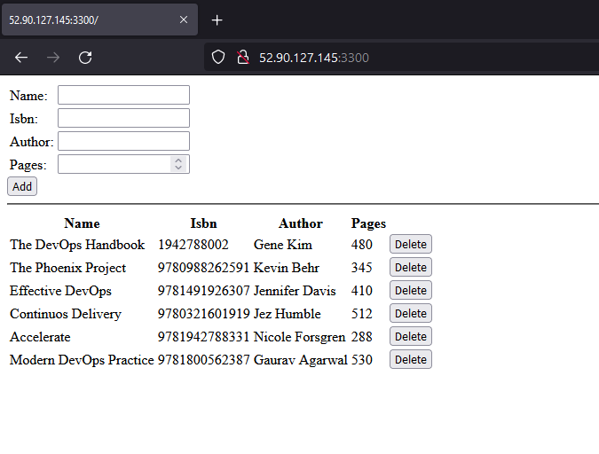

# **MEAN STACK DEPLOYMENT TO UBUNTU IN AWS**

MEAN Stack is a combination of the following components:

*	MongoDB (Document database) – Stores and allows to retrieve data.

*	Express (Back-end application framework) – Makes requests to Database for Reads and Writes.

*	Angular (Front-end application framework) – Handles Client and Server Requests

*	Node.js (JavaScript runtime environment) – Accepts requests and displays results to end user


## **Preparing prerequisites**
In order to complete this project you will need an AWS account (free tier) and a virtual server with Ubuntu Server OS.

Kindly choose the Ubuntu 20.04 version as that is most suitable for this project.

### **STEP 1: Install NodeJs**

`Node.js` is a JavaScript runtime built on Chrome’s V8 JavaScript engine. Node.js is used in this tutorial to set up the Express routes and AngularJS controllers.

Since this is our first time using `apt` for this session, start off by updating your server's package manager.

Update and Upgrade Ubuntu

```
sudo apt update && sudo apt upgrade -y

```


Install Node.JS from repository

```
curl -fsSL https://deb.nodesource.com/setup_18.x | sudo -E bash - &&\
sudo apt-get install -y nodejs
```


Confirm nodeJS installation

```
node --version
```


### **STEP 2: Install MongoDB**

MongoDB stores data in flexible, JSON-like documents. Fields in a database can vary from document to document and data structure can be changed over time. 

THESE STEPS FOR MongoDB installation are from https://www.mongodb.com/docs/manual/tutorial/install-mongodb-on-ubuntu/

Import the public key used by the package management system. 

```
sudo apt-get install gnupg
```


```
curl -fsSL https://pgp.mongodb.com/server-6.0.asc | \
sudo gpg -o /usr/share/keyrings/mongodb-server-6.0.gpg \
--dearmor
```


Create a list file for MongoDB. 
```
echo "deb [ arch=amd64,arm64 signed-by=/usr/share/keyrings/mongodb-server-6.0.gpg ] https://repo.mongodb.org/apt/ubuntu focal/mongodb-org/6.0 multiverse" | sudo tee /etc/apt/sources.list.d/mongodb-org-6.0.list
```


Reload local package database. 

```
sudo apt-get update
```


Install the MongoDB packages

```
sudo apt-get install -y mongodb-org
```


To be sure which init system your platform uses, run the following command:

```
ps --no-headers -o comm 1
```


Start MongoDB

```
sudo systemctl start mongod
```


**Install body-parser package**

We need ‘body-parser’ package to help us process JSON files passed in requests to the server.

```
sudo npm install body-parser
```


**Create a folder named ‘Books’**

```
mkdir Books && cd Books
```


**In the Books directory, Initialize npm project**

```
npm init
```


Add a file to it named server.js

```
vi server.js
```


Copy and paste the web server code below into the server.js file.

```
var express = require('express');
var bodyParser = require('body-parser');
var app = express();
app.use(express.static(__dirname + '/public'));
app.use(bodyParser.json());
require('./apps/routes')(app);
app.set('port', 3300);
app.listen(app.get('port'), function() {
    console.log('Server up: http://localhost:' + app.get('port'));
});

```


### **STEP 3: Install Express and set up routes to the server**

Express is a minimal and flexible Node.js web application framework that provides features for web and mobile applications. We will use Express in to pass book information to and from our MongoDB database.

Install Express

```
npm install express mongoose
```


In ‘Books’ folder, create a folder named apps

```
mkdir apps && cd apps
```


Create a file named routes.js

```
vi routes.js
```


Copy and paste the code below into routes.js

```
const Book = require('./models/book');

module.exports = function(app) {
  app.get('/book', function(req, res) {
    Book.find({}).then(result => {
      res.json(result);
    }).catch(err => {
      console.error(err);
      res.status(500).send('An error occurred while retrieving books');
    });
  });

  app.post('/book', function(req, res) {
    const book = new Book({
      name: req.body.name,
      isbn: req.body.isbn,
      author: req.body.author,
      pages: req.body.pages
    });
    book.save().then(result => {
      res.json({
        message: "Successfully added book",
        book: result
      });
    }).catch(err => {
      console.error(err);
      res.status(500).send('An error occurred while saving the book');
    });
  });

  app.delete("/book/:isbn", function(req, res) {
    Book.findOneAndRemove(req.query).then(result => {
      res.json({
        message: "Successfully deleted the book",
        book: result
      });
    }).catch(err => {
      console.error(err);
      res.status(500).send('An error occurred while deleting the book');
    });
  });

  const path = require('path');
  app.get('*', function(req, res) {
    res.sendFile(path.join(__dirname + '/public', 'index.html'));
  });
};
```


In the ‘apps’ folder, create a folder named models

```
mkdir models && cd models
```


Create a file named book.js

```
vi book.js
```


Copy and paste the code below into ‘book.js’

```
var mongoose = require('mongoose');
var dbHost = 'mongodb://localhost:27017/test';
mongoose.connect(dbHost);
mongoose.connection;
mongoose.set('debug', true);
var bookSchema = mongoose.Schema( {
  name: String,
  isbn: {type: String, index: true},
  author: String,
  pages: Number
});
var Book = mongoose.model('Book', bookSchema);
module.exports = mongoose.model('Book', bookSchema);

```


### **Step 4 – Access the routes with AngularJS**

AngularJS provides a web framework for creating dynamic views in your web applications. In this tutorial, we use AngularJS to connect our web page with Express and perform actions on our book register.

-------
-------

Change the directory back to ‘Books’

```
cd ../..
```


Create a folder named public

```
mkdir public && cd public
```


Add a file named script.js

```
vi script.js
```


Copy and paste the Code below (controller configuration defined) into the script.js file.

```
var app = angular.module('myApp', []);
app.controller('myCtrl', function($scope, $http) {
  $http( {
    method: 'GET',
    url: '/book'
  }).then(function successCallback(response) {
    $scope.books = response.data;
  }, function errorCallback(response) {
    console.log('Error: ' + response);
  });
  $scope.del_book = function(book) {
    $http( {
      method: 'DELETE',
      url: '/book/:isbn',
      params: {'isbn': book.isbn}
    }).then(function successCallback(response) {
      console.log(response);
    }, function errorCallback(response) {
      console.log('Error: ' + response);
    });
  };
  $scope.add_book = function() {
    var body = '{ "name": "' + $scope.Name + 
    '", "isbn": "' + $scope.Isbn +
    '", "author": "' + $scope.Author + 
    '", "pages": "' + $scope.Pages + '" }';
    $http({
      method: 'POST',
      url: '/book',
      data: body
    }).then(function successCallback(response) {
      console.log(response);
    }, function errorCallback(response) {
      console.log('Error: ' + response);
    });
  };
});

```


In public folder, create a file named index.html;

```
vi index.html
```


Copy and paste the code below into index.html file.

```
<!doctype html>
<html ng-app="myApp" ng-controller="myCtrl">
  <head>
    <script src="https://ajax.googleapis.com/ajax/libs/angularjs/1.6.4/angular.min.js"></script>
    <script src="script.js"></script>
  </head>
  <body>
    <div>
      <table>
        <tr>
          <td>Name:</td>
          <td><input type="text" ng-model="Name"></td>
        </tr>
        <tr>
          <td>Isbn:</td>
          <td><input type="text" ng-model="Isbn"></td>
        </tr>
        <tr>
          <td>Author:</td>
          <td><input type="text" ng-model="Author"></td>
        </tr>
        <tr>
          <td>Pages:</td>
          <td><input type="number" ng-model="Pages"></td>
        </tr>
      </table>
      <button ng-click="add_book()">Add</button>
    </div>
    <hr>
    <div>
      <table>
        <tr>
          <th>Name</th>
          <th>Isbn</th>
          <th>Author</th>
          <th>Pages</th>

        </tr>
        <tr ng-repeat="book in books">
          <td>{{book.name}}</td>
          <td>{{book.isbn}}</td>
          <td>{{book.author}}</td>
          <td>{{book.pages}}</td>

          <td><input type="button" value="Delete" data-ng-click="del_book(book)"></td>
        </tr>
      </table>
    </div>
  </body>
</html>

```


Change the directory back up to Books

```
cd ..
```

Start the server by running this command:

```
node server.js
```


The server is now up and running, we can connect it via port 3300. You can launch a separate Putty or SSH console to test what curl command returns locally.

```
curl -s http://localhost:3300
```


You need to open TCP port 3300 in your AWS Web Console for your EC2 Instance.


Now you can access our Book Register web application from the Internet with a browser using Public IP address or Public DNS name.


```
http://<PublicIP-or-PublicDNS>:3300

```




