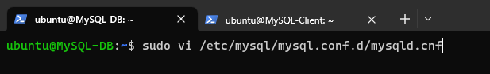

# **IMPLEMENTATION OF A CLIENT-SERVER ARCHITECTURE WITH MYSQL DATABASE MANAGEMENT SYSTEM (DBMS)**

Client-Server refers to an architecture in which two or more computers are connected together over a network to send and receive requests between one another.

In their communication, each machine has its own role -- the machine sending requests is usually referred as "Client" and the machine responding (serving) is called "Server".

A diagram of a Web Client-Server architecture is presented below:


To demonstrate a basic client-server using MySQL Relational Database Management System (RDBMS), follow the below instructions.

## **STEP 1**  

Create and configure two Linux-based virtual servers (EC2 instances with Ubuntu 20.04 LTS in AWS).

* Server A name - `MySQL-DB`
* Server B name - `MySQL-Client`


**Name the FIRST SERVER - MySQL-DB  (this is for convenience)**

```
sudo hostname MySQL-DB

bash

```


**Update and Upgrade your MySQL-DB virtual machine**

```
sudo apt update && sudo apt upgarde -y

```


### **STEP 2**
---

**On MySQL-DB virtual machine install MySQL Server software**

``````
sudo apt install mysql-server -y
``````


**Enable the MySQL Server and check the status**

``````
sudo systemctl enable mysql

sudo systemctl status mysql

``````


### STEP 3
----

**Name the SECOND SERVER - MySQL-Client (this is for convenience)**

``````
sudo hostname MySQL-Client

bash

``````


**Update and Upgrade your MySQL-Client virtual machine**

``````
sudo apt update && sudo apt upgrade -y

``````


**On the MySQL-CLient virtual Machine install mysql-client software**

``````
sudo apt install mysql-client -y

``````


### STEP 4
----

By default, both of your MySQL-DB and MySQL-Client servers are located in the same local virtual network, so they can communicate to each other using local IP addresses.

Use MySQL-DB server's local IP address to connect from MySQL-Client. MySQL-DB server uses TCP port 3306 by default, so you will have to open it by creating a new entry in ‘Inbound rules’ in ‘MySQL-DB server’ Security Groups. 

For extra security, do not allow all IP addresses to reach your ‘MySQL-DB server’ – allow access only to the specific local IP address of your ‘MySQL-Client’.

So we will add a new role `MYSQL/AURORA` get the ip address of the MySQL-Client and input into the new role.

**Run this command on the MySQL-Client Server to retrieve IP address** 

``````
ip addr show
``````


### STEP 5 
----

Before we configure MySQL server to allow connections from remote hosts, we need to create a user and database.


**Create password for the root user on MySQL-DB** 

``````
sudo mysql

ALTER USER 'root'@'localhost' IDENTIFIED WITH mysql_native_password BY 'Password.1';

exit

``````


**Run the MySQL secure installation procedure**

``````
sudo mysql_secure_installation

``````


**Create a user and database on your MySQL-DB Server**

``````
sudo mysql -p

CREATE USER 'external_user'@'%' IDENTIFIED WITH mysql_native_password BY 'password';

CREATE DATABASE `Project5_database`;

GRANT ALL ON Project5_database.* TO 'external_user'@'%';

exit

``````


**Configure MySQL server to allow connections from remote hosts.**


``````
sudo vi /etc/mysql/mysql.conf.d/mysqld.cnf

``````




**Restart the MySQL Service**


### STEP 6 
----

From MySQL-Client Linux Server connect remotely to MySQL-DB server Database Engine without using SSH. You must use the MySQL utility to perform this action

**Connect using the command below**

``````
sudo mysql -u external_user -h -p 172.31.28.77

``````


We have successfully connected from our MySQL-Client Server instance.

Let perfom this SQL command

``````
SHOW DATABASE
``````


If you see an output similar to the image above, then you have successfully completed this project – you have deloyed a fully functional MySQL Client-Server set up.