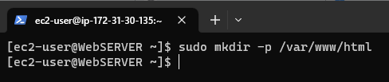
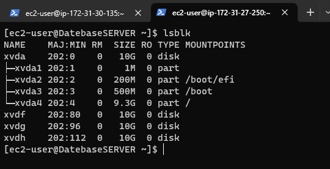
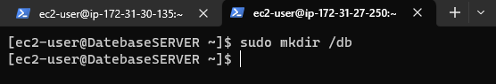
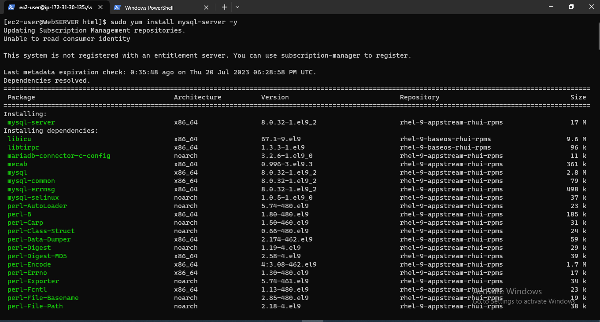
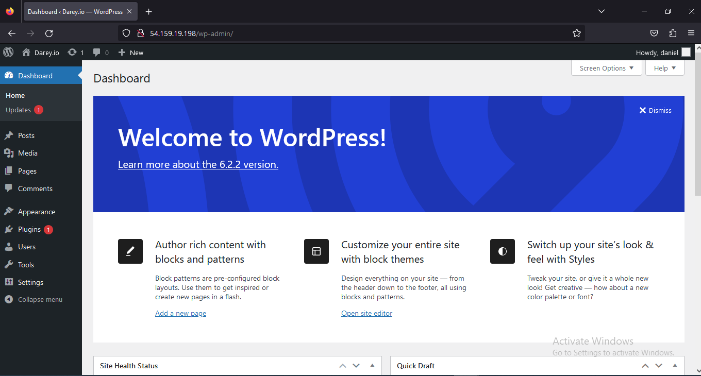

# WEB SOLUTION WITH WORDPRESS

In this project you will be tasked to prepare storage infrastructure on two Linux servers and implement a basic web solution using WordPress.

WordPress is a free and open-source content management system written in PHP and paired with MySQL or MariaDB as its backend Relational Database Management System (RDBMS).

This Project consists of two parts:

1. Configure storage subsystem for Web and Database servers based on Linux OS. The focus of this part is to give you practical experience of working with disks, partitions and volumes in Linux.

2. Install WordPress and connect it to a remote MySQL database server. This part of the project will solidify your skills of deploying Web and DB tiers of Web solution.

For this projects we shall use a very popular Linux distribution called ‘RedHat’.

---

## LAUNCH AN EC2 INSTANCE THAT WILL SERVE AS “WEB SERVER”

## **STEP 1 — Prepare a Web Server**

* Launch two EC2 instances that will serve as “Web Server” and "DataBase Server".

* Create 3 volumes in the same Availability Zone as your Web Server EC2, each of 10 GiB.


* Repeat the following steps to create two more volumes for the WebSERVER.

* Name the FIRST SERVER -   (this is for convenience)

```bash
sudo hostname WebSERVER

bash
```


* Run the `lsblk` command to inspect what block devices are attached to your EC2 WebSERVER.


* Use `df -h` command to see all mounts and free space on your server


It is important to note that the attached volumes are listed in the `/dev` folder. We will need to access this folder in order to create partitions with the `gdisk` utility.


* Use `gdisk` utility to create a single partition on each of the 3 disks (xvdf, xvdg, xvdh)

```bash
sudo gdisk /dev/xvdf

```

Follow the screen shots to know the prompt response at each stage of the partition utility.


Run the `gdisk` utility for the next volume `/dev/xvdg`

```bash
sudo gdisk /dev/xvdg

```


Run the `gdisk` utility for the next volume `/dev/xvdh`

```bash
sudo gdisk /dev/xvdh

```


* Use `lsblk` utility to view the newly configured partition on each of the 3 disks.


* Install lvm2 package using sudo yum install lvm2.

```bash
sudo yum install lvm2 -y

```


Let's confirm that `lvm` has bin installed on our Server.


* Use pvcreate utility to mark each of 3 disks as physical volumes (PVs) to be used by LVM

```bash
sudo pvcreate /dev/xvdf1 /dev/xvdg1 /dev/xvdh1
```


* Verify that your Physical volume has been created successfully by running `sudo pvs`

```bash
sudo pvs

```


* Use `vgcreate` utility to add all 3 PVs to a volume group (VG). Name the VG `webdata-vg`

```bash
sudo vgcreate webdata-vg /dev/xvdh1 /dev/xvdg1 /dev/xvdf1
```


* Verify that your VG has been created successfully by running `sudo vgs`

```bash
sudo vgs

```


* Use lvcreate utility to create 2 logical volumes. `apps-lv` (Use half of the PV size), and `logs-lv` Use the remaining space of the PV size.

**NOTE:** `apps-lv` will be used to store data for the Website while, `logs-lv` will be used to store data for logs.

```bash
sudo lvcreate -n apps-lv -L 14G webdata-vg

sudo lvcreate -n logs-lv -L 14G webdata-vg

```


* Verify that your Logical Volume has been created successfully by running `sudo lvs`

```bash
sudo lvs

```


* Verify the entire setup

```bash
sudo vgdisplay -v #view complete setup - VG, PV, and LV

sudo lsblk

```


* Use `mkfs.ext4` to format the logical volumes with ext4 filesystem

```bash

sudo mkfs -t ext4 /dev/webdata-vg/apps-lv

sudo mkfs -t ext4 /dev/webdata-vg/logs-lv

```


* Create /var/www/html directory to store website files

```bash
sudo mkdir -p /var/www/html
```



* Create /home/recovery/logs to store backup of log data

```bash
sudo mkdir -p /home/recovery/logs
```


* Mount /var/www/html on apps-lv logical volume. Best practise will be to check the /var/www/html for any contents befor mounting the volume because evrey volume mount deletes the content of the directory they are mounted on.

```bash
sudo mount /dev/webdata-vg/apps-lv /var/www/html/
```


* Confrim that the volume has been mounted by running df -h command.


* Use `rsync` utility to backup all the files in the log directory /var/log into /home/recovery/logs
_(This is required before mounting the file system)_

```bash

sudo rsync -av /var/log/. /home/recovery/logs/
```


* Mount /var/log on logs-lv logical volume. _(Note that all the existing data on /var/log will be deleted. That is why the above step is very important)_

``````bash
sudo mount /dev/webdata-vg/logs-lv /var/log
``````


* Restore log files back into /var/log directory

```bash
sudo rsync -av /home/recovery/logs/log/. /var/log
```


The files have been successfully restored


Verfiy that all mounts have been successful


* Update `/etc/fstab` file so that the mount configuration will persist after restart of the server.

  The UUID of the device will be used to update the /etc/fstab file.

  Run the sudo blkid, pick the UUID equivalent to the logical volumes and update the file.

```bash
sudo blkid

sudo vi /etc/fstab
```


Run the `sudo mount -a` to test your configuration and then reload the daemom.


Verify your setup by running `df -h`, output must look like this:


---
PREPARE THE DATABASE SERVER

---

## **STEP 2 — Prepare the Database Server**

* Repeat the steps used in creating volumes for your WebSERVER but now apply them for the Database SERVER


* Run the `lsblk` command to inspect what block devices are attached to your EC2 DataBaseSERVER.



* Use `gdisk` utility to create a single partition on each of the 3 disks (xvdf, xvdg, xvdh)

```bash

sudo gdisk /dev/xvdf

sudo gdisk /dev/xvdg

sudo gdisk /dev/xvdh

```


* Use lsblk utility to view the newly configured partition on each of the 3 disks.


* Install lvm2 package using sudo yum install lvm2.

```bash
sudo yum install lvm2 -y

```


* Use pvcreate utility to mark each of 3 disks as physical volumes (PVs) to be used by LVM

```bash
sudo pvcreate /dev/xvdf1 /dev/xvdg1 /dev/xvdh1
```


* Use `vgcreate` utility to add all 3 PVs to a volume group (VG). Name the VG `vg-database`

```bash
sudo vgcreate vg-database /dev/xvdf1 /dev/xvdg1 /dev/xvdh1
```


* Verify that your VG has been created successfully by running `sudo vgs`

```bash
sudo vgs

```


* Use lvcreate utility to create a logical volume `db-lv`

```bash
sudo lvcreate -n db-lv -L 25G vg-database

sudo lvs

```


* Use `mkfs.ext4` to format the logical volume with ext4 filesystem

```bash
sudo mkfs.ext4 /dev/vg-database/db-lv
```


* Create a mount point

```bash
sudo mkdir /db
```



* Mount the Volume on `/db`


* Verfiy that the volume has been correctly mounted


* Update `/etc/fstab` file so that the mount configuration will persist after restart of the server.

  The UUID of the device will be used to update the /etc/fstab file.

  Run the sudo blkid, pick the UUID equivalent to the logical volumes and update the file.

```bash
sudo blkid

sudo vi /etc/fstab
```


---

## **Step 3 — Install WordPress on your Web Server EC2**

---

* Update the repository on your WebSERVER and your DatabaseSERVER with the command below

```bash
sudo yum update -y

```


* Confirm from your security group that the corresponding ports are open to allow communucation.
_(on this project we allowed all traffic BUT this is not encouraged for a PRODUCTION environment)_


On your WebSERVER, Install wget, Apache and it’s dependencies


* We will then install PHP and it’s depemdencies

```bash

sudo dnf install https://dl.fedoraproject.org/pub/epel/epel-release-latest-8.noarch.rpm

sudo dnf install php php-opcache php-gd php-curl php-mysqlnd

php -v

sudo systemctl start php-fpm

sudo systemctl enable php-fpm

sudo systemctl status php-fpm

#To instruct SELinux to allow Apache to execute the PHP code via PHP-FPM run.

sudo setsebool -P httpd_execmem 1

```


* Start Apache

```bash
sudo systemctl start httpd

sudo systemctl status httpd

```


* View the Apache default web page by copying the Public IP of your WebSERVER and run on a browser


* Download wordpress

```bash

mkdir wordpress

cd wordpress

sudo wget http://wordpress.org/latest.tar.gz

```


* Copy the Wordpress files to `/var/www/html`

```bash
sudo cp -R wordpress/. /var/www/html/
```


* Confirm the copy process was successful

```bash
sudo ls -l /var/www/html/
```


---

## **Step 4 — Install MySQL on your DatabaseSERVER Server and WebSERVER**

---

```bash
sudo yum install mysql-server -y

sudo systemctl start mysqld

sudo systemctl enable mysqld

sudo systemctl status mysqld

```




---

## **Step 5 — Configure DB to work with WordPress**

---

```bash
sudo mysql_secure_installation
```


```bash
sudo mysql -u root -p

mysql> Create databases wordpress;

mysql> show databases;
```


```bash

mysql> CREATE USER 'daniel'@'%' IDENTIFIED WITH mysql_native_password BY 'password';

mysql> GRANT ALL PRIVILEGES ON *.* TO 'daniel'@'%' WITH GRANT OPTION;

mysql> flush privileges;

mysql> select user, host from mysql.user;

```


---

## **Step 6 — Configure WordPress to connect to remote database.**

---

* We need to set the bind address

```bash
sudo vi /etc/my.cnf
```


* Restart mysqld service


* Back to our WebSERVER, we will configure our `wp-config.php` with database enetring Database credentials for smooth connection

```bash
sudo vi wp-config.php
```


Restart  Apache

```bash
sudo systemctl restart httpd

```


* Disable the default Apache welcome page with the command below


* Confirm the your WebSERVER can talk to the Database SERVER

  Verify if you can successfully execute `SHOW DATABASES;` command and see a list of existing databases.


* Change permissions and configuration so Apache could use WordPress:

```bash
sudo chown -R apache:apache /var/www/html/wordpress

sudo chcon -t httpd_sys_rw_content_t /var/www/html/wordpress -R

sudo setsebool -P httpd_can_network_connect=1

```


* Try to access from your browser the link to your WordPress `http://<Web-Server-Public-IP-Address>/wordpress/`


* Fill out your DB credentials:


* If you see this message – it means your WordPress has successfully connected to your remote MySQL database



