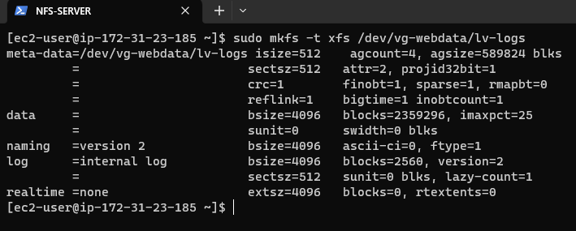
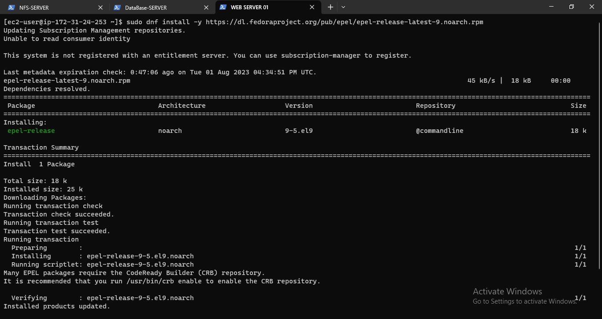
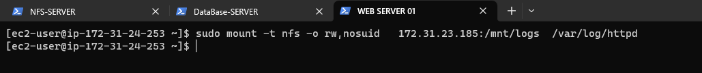

# **DEVOPS TOOLING WEBSITE SOLUTION**

As a member of a DevOps team, you will implement a tooling website solution which makes access to DevOps tools within the corporate infrastructure easily accessible.

In this project you will implement a solution that consists of following components:

1. Infrastructure: AWS

2. Webserver Linux:  Red Hat Enterprise Linux 8  

3. Database Server: Ubuntu 20.04 + MySQL

4. Storage Server: Red Hat Enterprise Linux 8 + NFS Server

5. Programming Language:PHP

6. Code Repository: GitHub


## **STEP 1 – PREPARE NFS SERVER**

1. Spin up four (4) new EC2 instances with RHEL Linux 9 Operating System, one (1) new EC2 instance with Ubuntu 20.04 operating system.


2, Based on your LVM experience from Project 6, Configure LVM on the RHEL Linux 9 Server.

* Create three (3) volumes for the NFS Server.


* Attach the volumes to the NFS Server.


* Use the `gdisk` utility to create partitions on the volume.

```bash
sudo gdisk /dev/xvdf

sudo gdisk /dev/xvdg

sudo gdisk /dev/xvdh

```


* Install the `lvm` with the code

```bash
sudo yum install lvm2 -y
```

* After which you will create physical partitions, a volume group and logical volumes.


* Create physcial partitions

```bash
sudo pvcreate /dev/xvdf1 /dev/xvdg1 /dev/xvdh1

sudo pvs

```


* Create a Volume group

```bash
sudo vgcreate vg-webdata /dev/xvdf1 /dev/xvdg1 /dev/xvdh1

sudo vgs
```


* Create Logical volumes

```bash

sudo lvcreate -n lv-apps -L 9G vg-webdata

sudo lvcreate -n lv-logs -L 9G vg-webdata

sudo lvcreate -n lv-opt -L 9G vg-webdata

```


* Instead of formatting the disks as `ext4` you will have to format them as `xfs`

```bash
sudo mkfs -t xfs /dev/vg-webdata/lv-apps

sudo mkfs -t xfs /dev/vg-webdata/lv-logs

sudo mkfs -t xfs /dev/vg-webdata/lv-opt

```





* Create mount points on /mnt directory for the logical volumes as follow:

  * Mount lv-apps on /mnt/apps – To be used by Webserver

  * Mount lv-logs on /mnt/logs – To be used by Webserver logs

  * Mount lv-opt on /mnt/opt – To be used by Jenkins server in Project 8

```bash
sudo mkdir /mnt/apps

sudo mkdir /mnt/logs

sudo mkdir /mnt/opt

```


```bash

sudo  mount /dev/vg-webdata/lv-aps /mnt/apps

sudo mount /dev/vg-webdata/lv-logs /mnt/logs

sudo mount /dev/vg-webdata/lv-opt /mnt/opt

```


3, Install NFS server, configure it to start on reboot and make sure it is up and running

```bash
sudo yum -y update

sudo yum install nfs-utils -y

sudo systemctl start nfs-server.service

sudo systemctl enable nfs-server.service

sudo systemctl status nfs-server.service

```


4, Export the mounts for Webserver’ subnet cidr to connect as clients.

For simplicity, you will install your all three Web Servers inside the same subnet, but in production set up you would probably want to separate each tier inside its own subnet for higher level of security.

Make sure we set up permission that will allow our Web servers to read, write and execute files on NFS:

```bash
sudo chown -R nobody: /mnt/apps
sudo chown -R nobody: /mnt/logs
sudo chown -R nobody: /mnt/opt

sudo chmod -R 777 /mnt/apps
sudo chmod -R 777 /mnt/logs
sudo chmod -R 777 /mnt/opt

sudo systemctl restart nfs-server.service

```


* Configure access to NFS for clients within the same subnet(example of Subnet CIDR – 172.31.32.0/20 ):

```bash

sudo vi /etc/exports

/mnt/apps <Subnet-CIDR>(rw,sync,no_all_squash,no_root_squash)

/mnt/logs <Subnet-CIDR>(rw,sync,no_all_squash,no_root_squash)

/mnt/opt <Subnet-CIDR>(rw,sync,no_all_squash,no_root_squash)


sudo exportfs -arv
```


5, Check which port is used by NFS and open it using Security Groups (add new Inbound Rule)

```bash

rpcinfo -p | grep nfs
```


---
**Important note:**

In order for NFS server to be accessible from your client, you must also open following ports:
TCP 111, UDP 111, UDP 2049

---


## **STEP 2 — CONFIGURE THE DATABASE SERVER**

1) Run an update on the server

```bash
sudo apt update
```


2, Install MySQL server

```bash
sudo apt install mysql-server -y

```


3, Create a database and name it `tooling`

4, Create a database user and name it `webaccess`

5, Grant permission to `webaccess` user on tooling database to do anything only from the webservers `subnet cidr`


## **STEP 3 — PREPARE THE WEB SERVERS**

Since we are using NFS, all our Webservers can access the storage and can use the same storage. Once we add or make changes on one server, the other servers will automatically get the changes.

During the next steps we will do following:

* Configure NFS client (this step must be done on all three servers)

* Deploy a Tooling application to our Web Servers into a shared NFS folder

* Configure the Web Servers to work with a single MySQL database
  
1. Install NFS client

```bash
sudo yum install nfs-utils nfs4-acl-tools -y
```


2, Mount `/var/www/` and target the NFS server’s export for apps

```bash

sudo mkdir /var/www

sudo mount -t nfs -o rw,nosuid <NFS-Server-Private-IP-Address>:/mnt/apps /var/www

```


3, Verify that NFS was mounted successfully by running df -h. Make sure that the changes will persist on Web Server after reboot.

```bash

df -h
```


```bash

sudo vi /etc/fstab

<NFS-Server-Private-IP-Address>:/mnt/apps /var/www nfs defaults 0 0
```


4, Install Remi’s repository, Apache and PHP

```bash

sudo yum install httpd -y

sudo yum update 

#Use the below command to configure the EPEL repository on your system

sudo dnf install -y https://dl.fedoraproject.org/pub/epel/epel-release-latest-9.noarch.rpm 

#configure the REMI repository by running the below command

sudo dnf install -y https://rpms.remirepo.net/enterprise/remi-release-9.

#Once the repository installation is finished, list all the available PHP module streams with the following command

sudo dnf module list php 

#select a version as per your requirements
sudo dnf module enable php:remi-8.2

sudo dnf install php php-cli php-common 

sudo dnf install php php-opcache php-gd php-curl php-mysqlnd

sudo systemctl start php-fpm

sudo systemctl enable php-fpm

sudo setsebool -P httpd_execmem 1

php -v 

```





**Repeat steps 1-4 for another 2 Web Servers.**

5, Verify that Apache files and directories are available on the Web Server in `/var/www` and also on the NFS server in `/mnt/apps`. If you see the same files – it means NFS is mounted correctly. You can try to create a new file touch `test.txt` from one server and check if the same file is accessible from other Web Servers.


6, Locate the log folder for Apache on the Web Server and mount it to NFS server’s export for logs.

```bash

sudo mount -t nfs -o rw,nosuid   <NFS-server-private-IP-address>:/mnt/logs  /var/log/httpd

sudo vi /etc/fstab

<NFS-Private-IP>:/mnt/logs  /var/log/httpd  nfs    defaults  0 0
```




7, Fork the tooling source code from Darey.io Github Account to your Github account.

```bash

sudo yum install git –y
```


```bash
git init 
```


```bash
git clone https://github.com/darey-io/tooling.git
```


8, Deploy the tooling website’s code to the Webserver. Ensure that the html folder from the repository is deployed to `/var/www/html`


**Note 1:** Do not forget to open TCP port 80 on the Web Server.


**Note 2:** If you encounter 403 Error – check permissions to your `/var/www/html` folder and also disable SELinux `sudo setenforce 0`


To make this change permanent – open following config file `sudo vi /etc/sysconfig/selinux` 

```bash
sudo vi /etc/sysconfig/selinux
```

And set `SELINUX=disabled` then restart httpd.


9, Update the website’s configuration to connect to the database

```bash
Sudo  vi /var/www/html/functions.php
```


10, Be sure to install mysql-client on the web server


11, Set the security rule for your Database SERVER


12, Remember to set the bind address for your sql server


  * Restart the Database Server

  ```bash
      sudo systemctl restart mysql
      sudo systemctl status mysq
  ```


13, Apply tooling-db.sql script to your database using this command `mysql -h <databse-private-ip> -u <db-username> -p <db-name> < tooling-db.sql`


```bash

username: admin

Password: admin

```


