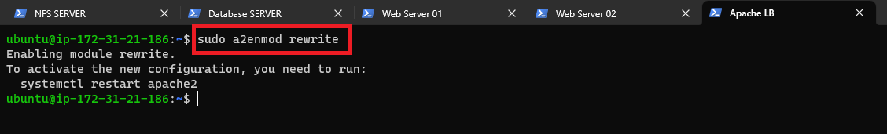
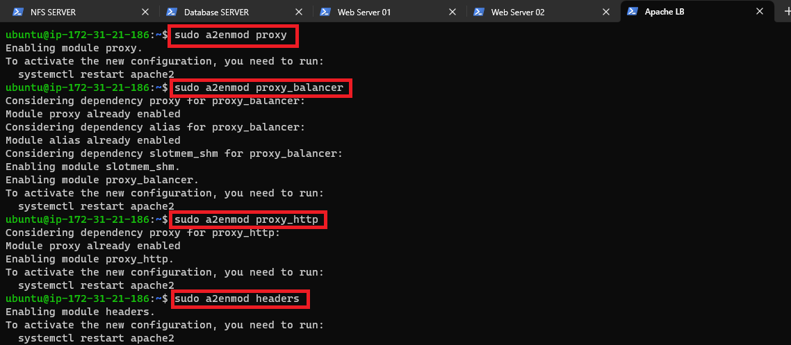
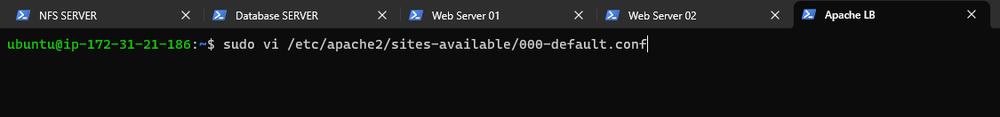
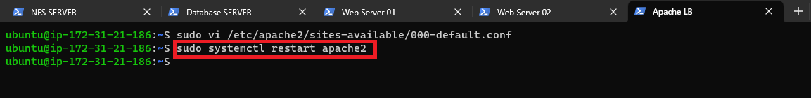
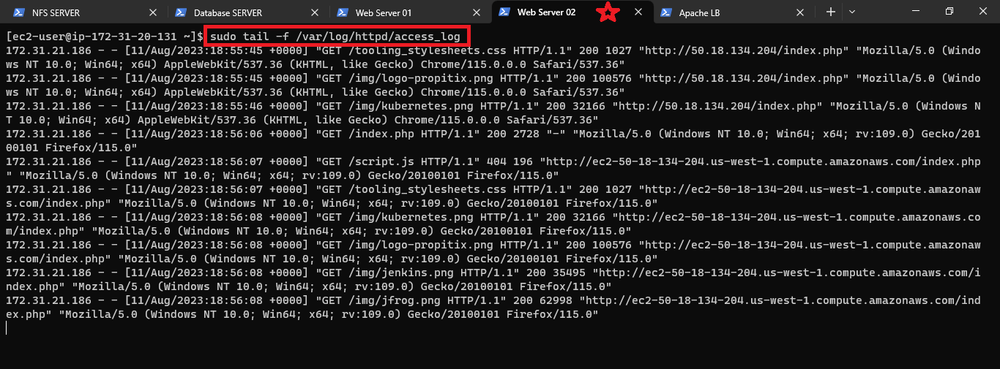

# **LOAD BALANCER SOLUTION WITH APACHE**

Prerequisites
Before you begin with this project, Make sure that you have following servers installed and configured within Project-7:

1. Two RHEL8 Web Servers
2. One MySQL DB Server (based on Ubuntu 20.04)
3. One RHEL8 NFS server


## **CONFIGURE APACHE AS A LOAD BALANCER**

1. Create an Ubuntu Server 20.04 EC2 instance and name it `Project-8-apache-lb`, so your EC2 list will look like this:


2. Open TCP port 80 on Project-8-apache-lb by creating an Inbound Rule in Security Group.


3. Install Apache Load Balancer on `Project-8-apache-lb` server and configure it to point traffic coming to LB to both Web Servers:

```bash
#Install apache2
sudo apt update
sudo apt install apache2 -y
sudo apt-get install libxml2-dev

#Enable following modules:
sudo a2enmod rewrite
sudo a2enmod proxy
sudo a2enmod proxy_balancer
sudo a2enmod proxy_http
sudo a2enmod headers
sudo a2enmod lbmethod_bytraffic

#Restart apache2 service
sudo systemctl restart apache2
```







* Configure load balancing

```bash

sudo vi /etc/apache2/sites-available/000-default.conf

#Add this configuration into this section <VirtualHost *:80>  </VirtualHost>

<Proxy "balancer://mycluster">
      BalancerMember http://<WebServer1-Private-IP-Address>:80 loadfactor=5 timeout=1
      BalancerMember http://<WebServer2-Private-IP-Address>:80 loadfactor=5 timeout=1
      ProxySet lbmethod=bytraffic
      # ProxySet lbmethod=byrequests
</Proxy>

ProxyPreserveHost On
ProxyPass / balancer://mycluster/
ProxyPassReverse / balancer://mycluster/

#Restart apache server

sudo systemctl restart apache2

```







`bytraffic` balancing method will distribute incoming load between your Web Servers according to current traffic load. We can control in which proportion the traffic must be distributed by `loadfactor` parameter.

4. Verify that our configuration works – try to access your LB’s public IP address or Public DNS name from your browser:

```bash
http://<Load-Balancer-Public-IP-Address-or-Public-DNS-Name>/index.php
```


Open two ssh/Putty consoles for both Web Servers and run following command:

```bash
sudo tail -f /var/log/httpd/access_log
```




Try to refresh your browser page `http://<Load-Balancer-Public-IP-Address-or-Public-DNS-Name>/index.php` several times and make sure that both servers receive HTTP GET requests from your LB – new records must appear in each server’s log file.

The number of requests to each server will be approximately the same since we set `loadfactor` to the same value for both servers – it means that traffic will be distributed evenly between them.


## **Optional Step – Configure Local DNS Names Resolution**

Sometimes it is tedious to remember and switch between IP addresses, especially if you have a lot of servers under your management.
What we can do, is to configure local domain name resolution.

The easiest way is to use `/etc/hosts` file, although this approach is not very scalable, but it is very easy to configure and shows the concept well. So let us configure IP address to domain name mapping for our LB.

```bash
#Open this file on your LB server

sudo vi /etc/hosts

#Add 2 records into this file with Local IP address and arbitrary name for both of your Web Servers

<WebServer1-Private-IP-Address> Web1
<WebServer2-Private-IP-Address> Web2

```


* Now you can update your LB config file with those names instead of IP addresses

```bash
BalancerMember http://Web1:80 loadfactor=5 timeout=1
BalancerMember http://Web2:80 loadfactor=5 timeout=1
```


You can try to curl your Web Servers from LB locally `curl http://Web1` or `curl http://Web2` – it shall work.


**Targeted Architecture**

Now your setup looks like this:


