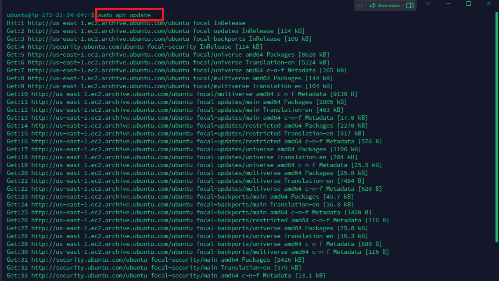
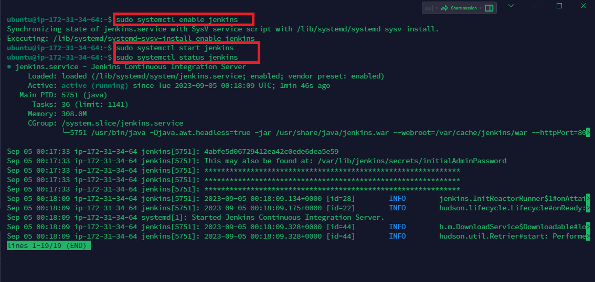
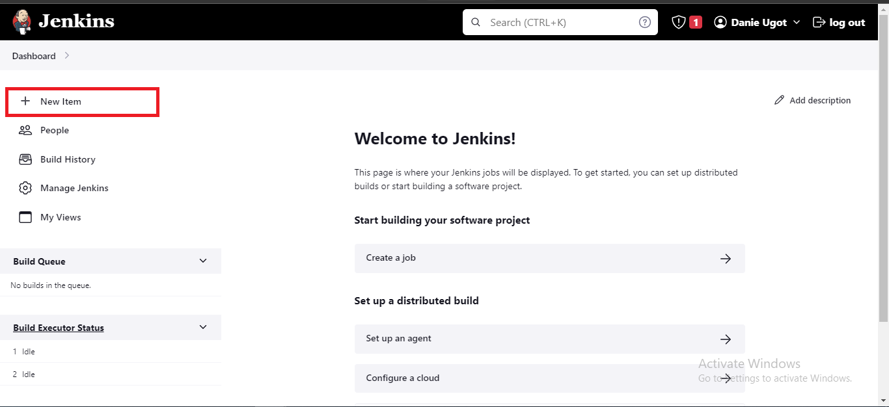
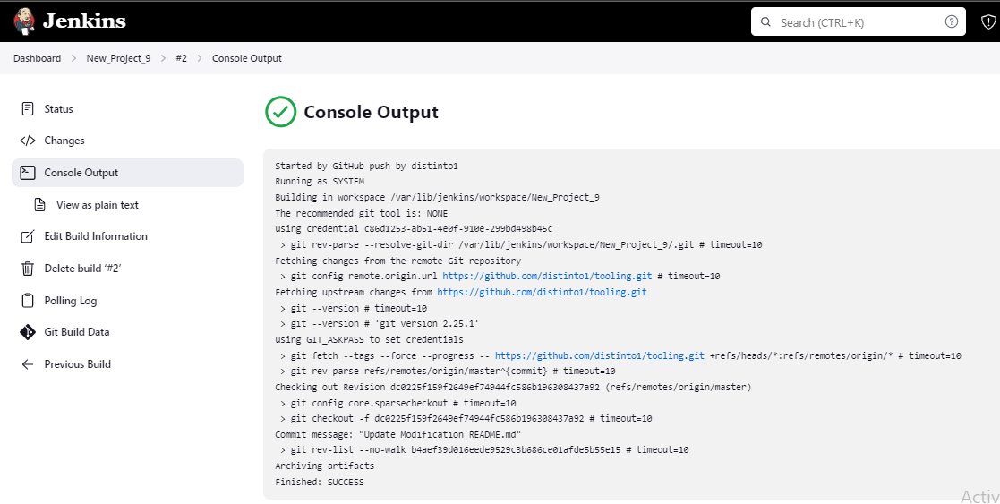

# TOOLING WEB SITE DEPLOYMENT AUTOMATION WITH CONTINUOUS INTEGRATION

## AN INTRODUCTION TO JENKINS

DevOps is about Agility, and Speedy release of software and web solutions. One of the ways to guarantee fast and repeatable deployments is the automation of routine tasks.

In this project we are going to start automating part of our routine tasks with a free and open source automation server – Jenkins. It is one of the most popular CI/CD tools.

In our project we are going to utilize Jenkins CI capabilities to make sure that every change made to the source code in GitHub will be automatically be updated to the Tooling Website.


## INSTALL AND CONFIGURE JENKINS SERVER

Step 1 – Install Jenkins server

1. Create an AWS EC2 server based on Ubuntu Server 20.04 LTS and name it “Jenkins”

2. Install JDK (since Jenkins is a Java-based application)

```bash
sudo apt update

sudo apt install openjdk-11-jdk -y

java -version

```




3. Install Jenkins

```bash
curl -fsSL https://pkg.jenkins.io/debian-stable/jenkins.io-2023.key | sudo tee \
  /usr/share/keyrings/jenkins-keyring.asc > /dev/null
  
  
echo deb [signed-by=/usr/share/keyrings/jenkins-keyring.asc] \
  https://pkg.jenkins.io/debian-stable binary/ | sudo tee \
  /etc/apt/sources.list.d/jenkins.list > /dev/null
  
  
sudo apt-get update


sudo apt-get install jenkins -y

```


Make sure Jenkins is up and running

```bash

sudo systemctl enable jenkins


sudo systemctl start jenkins


sudo systemctl status jenkins

```



4. By default Jenkins server uses TCP port 8080 – open it by creating a new Inbound Rule in your EC2 Security Group


5. Perform initial Jenkins setup.

From your browser access `http://<Jenkins-Server-Public-IP-Address-or-Public-DNS-Name>:8080`

You will be prompted to provide a default admin password


Retrieve it from your server:

```bash
sudo cat /var/lib/jenkins/secrets/initialAdminPassword
```


Then you will be asked which plugins to install – choose suggested plugins.


Once plugins installation is done – create an admin user and you will get your Jenkins server address.


The installation is completed!


## Step 2 – Configure Jenkins to retrieve source codes from GitHub using Webhooks

1. Enable webhooks in your GitHub repository settings

You will locate webhooks from the tooling repository and then you click on settings


Add webhooks


Fill in the url of your Jenkins Server and select content-typr to application/json.

Click Okay to complete.


2. Go to Jenkins web console, click “New Item” and create a “Freestyle project”




Under Source code mamangement, select Git and fill in the repsoitory url. Make sure to add cerdentials.
This will enable connection with your GitHub repository.


Save the configuration and let us try to run the build. For now we can only do it manually.

Click `“Build Now”` button, if you have configured everything correctly, the build will be successful and you will see it under #1.


You can open the build and check in “Console Output” if it has run successfully.

Console Output shows a  `FINISHED SUCCESS` meaning the build was successful

Congratulations! You have just made your very first Jenkins build!


3. Click “Configure” your job/project and add these two configurations

Configure triggering the job from GitHub webhook:

Go to the Project again, click on configure.

Under Build Triggers, select `GitHub Hook trigger for GITScm polling`


Configure “Post-build Actions” to archive all the files – files resulted from a build are called “artifacts”.


Now, go ahead and make some change in any file in your GitHub repository (e.g. README.MD file) and push the changes to the master branch.


You will see that a new build has been launched automatically (by webhook) and you can see its results – artifacts, saved on Jenkins server.





You have now configured an automated Jenkins job that receives files from GitHub by webhook trigger (this method is considered as ‘push’ because the changes are being ‘pushed’ and files transfer is initiated by GitHub).

## CONFIGURE JENKINS TO COPY FILES TO NFS SERVER VIA SSH

**Step 3 – Configure Jenkins to copy files to NFS server via SSH**

Now we have our artifacts saved locally on Jenkins server, the next step is to copy them to our NFS server to `/mnt/apps` directory.

Jenkins is a highly extendable application and there are 1400+ plugins available. We will need a plugin that is called `“Publish Over SSH”.`

1; Install "PUBLISH OVER SSH" plugin

On the main dashboard select `"Manage Jenkins"` and choose `"Manage Plugins"` menu item.

On the `Available tab` search for "Publish Over SSH" plugin and install it.


2; Configure the job/project to copy artifacts over to NFS server.

On main dashboard select “Manage Jenkins” and choose “Configure System” menu item.

Scroll down to Publish over SSH plugin configuration section and configure it to be able to connect to your NFS server:

1. Provide a private key (content of .pem file that you use to connect to NFS server via SSH/Putty)

1. Arbitrary name

1. Hostname – can be `private IP address` of your NFS server

1. Username – `ec2-user` (since NFS server is based on EC2 with RHEL 8)

1. Remote directory – `/mnt/apps` since our Web Servers use it as a mointing point to retrieve files from the NFS server

Test the configuration and make sure the connection returns Success. Remember, that TCP port 22 on NFS server must be open to receive SSH connections.


Save the configuration, open your Jenkins job/project configuration page and add another one “Post-build Action”


Configure it to send all files produced by the build into our previously define remote directory. In our case we want to copy all files and directories – so we use **.


Save this configuration and go ahead, change something in README.MD file in your GitHub Tooling repository.


Webhook will trigger a new job and in the “Console Output” of the job you will find something like this:

```bash

SSH: Transferred 25 file(s)
Finished: SUCCESS
```


To make sure that the files in `/mnt/apps` have been updated – connect via SSH/Putty to your NFS server and check README.MD file

```bash
cat /mnt/apps/README.md
```


If you see the changes you had previously made in your GitHub – the job works as expected.

Congratulations!

You have just implemented your first Continuous Integration solution using Jenkins CI. Watch out for advanced CI configurations in upcoming projects.
