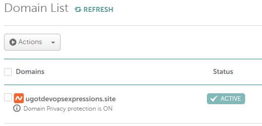
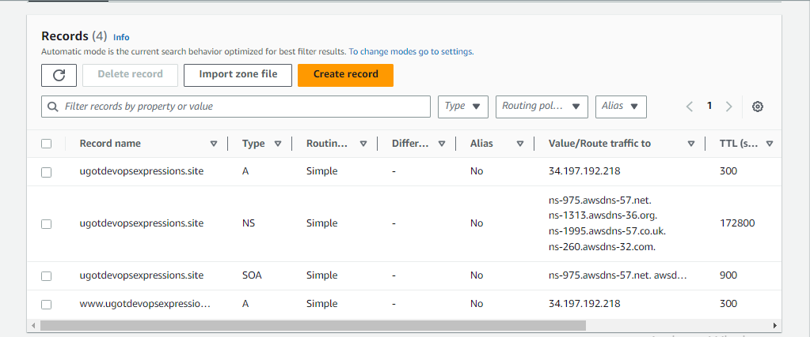
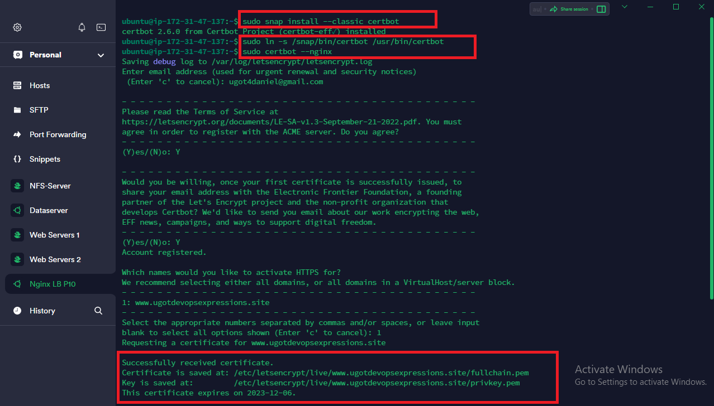

# LOAD BALANCER SOLUTION WITH NGINX AND SSL/TLS

This project consists of two parts:

1. Configure Nginx as a Load Balancer

1. Register a new domain name and configure secured connection using SSL/TLS certificates

Your target architecture will look like this:


## CONFIGURE NGINX AS A LOAD BALANCER

You can either uninstall Apache from the existing Load Balancer server, or create a fresh installation of Linux for Nginx.

1. Create an EC2 VM based on Ubuntu Server 20.04 LTS and name it Nginx LB (do not forget to open TCP port 80 for HTTP connections, also open TCP port 443 – this port is used for secured HTTPS connections)


1. Update `/etc/hosts` file for local DNS with Web Servers’ names (e.g. Web1 and Web2) and their local IP addresses


1. Install and configure Nginx as a load balancer to point traffic to the resolvable DNS names of the webservers

Update the instance and Install Nginx

```bash
sudo apt update
sudo apt install nginx
```


Configure Nginx LB using Web Servers’ names defined in `/etc/hosts`

Open the default nginx configuration file

```bash

sudo vi /etc/nginx/nginx.conf
```

---

```bash
#insert following configuration into http section

 upstream myproject {
    server Web1 weight=5;
    server Web2 weight=5;
  }

server {
    listen 80;
    server_name www.domain.com;
    location / {
      proxy_pass http://myproject;
    }
  }

#comment out this line
#       include /etc/nginx/sites-enabled/*;


```


Restart Nginx and make sure the service is up and running

```bash

sudo systemctl restart nginx
sudo systemctl status nginx
```


## REGISTER A NEW DOMAIN NAME AND CONFIGURE SECURED CONNECTION USING SSL/TLS CERTIFICATES

Let us make necessary configurations to make connections to our Tooling Web Solution secured!

In order to get a valid SSL certificate – you need to register a new domain name, you can do it using any Domain name registrar – a company that manages reservation of domain names. 

The most popular ones are: Godaddy.com, Domain.com, Bluehost.com.

1. Register a new domain name with any registrar of your choice in any domain zone (e.g. .com, .net, .org, .edu, .info, .xyz or any other)



2. Assign an Elastic IP to your Nginx LB server and associate your domain name with this Elastic IP

* open the Amazon EC2 console at https://console.aws.amazon.com/ec2/.

* In the navigation pane, choose Elastid IPs.

* Select the Elastic IP address to associate and choose actions, Associate Elastic IP address.

* For  resource type, choose Instance.

* For Instance, choose the instance with which you wish to assoicate the Elastic IP address.

* Choose Associate.


3. Update A record in your registrar to point to Nginx LB using Elastic IP address

* Search for Route 53 on your AWS Management console

* Create a Public Hosted Zone

* Link your domain name to Route 53 by copying your nameservers from Route 53 to your domain

* create A records in your registrar - Route 53 and point to the Loadbalancer public IP - Elastic IP address





4.	Configure Nginx to recognize your new domain name

This do by updating the /etc/nginx/nginx.conf file with server_name `www.<your-domain-name.com>` instead of server_name www.domain.com

```bash

server_name www.<your-domain-name.com>

```


5.	Install certbot and request for an SSL/TLS certificate for the domain name.

**NB: Make sure snapd service is active and running on the server**

```bash
sudo systemctl status snapd
```

Install certbot

```bash

sudo snap install --classic certbot
```

Make request for your certificate for the domain name

```bash
sudo ln -s /snap/bin/certbot /usr/bin/certbot
sudo certbot --nginx
```




Test secured access to your Web Solution by trying to reach https://<your-domain-name.com>


6.	Set up periodical renewal of your SSL/TLS certificate.

By default, LetsEncrypt certificate is valid for 90 days, so it is recommended to renew it at least every 60 days or more frequently.

You can test renewal command in dry-run mode

```bash
sudo certbot renew --dry-run
```

Best practice is to have a scheduled job that to run renew command periodically.

Let us configure a cronjob to run the command twice a day.

To do so, lets edit the crontab file with the following command:

```bash
crontab -e
```

Add following line:

```bash
* */12 * * *   root /usr/bin/certbot renew > /dev/null 2>&1
```

You can always change the interval of this cronjob if twice a day is too often by adjusting schedule expression.

