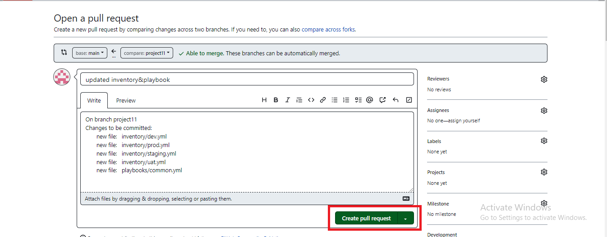
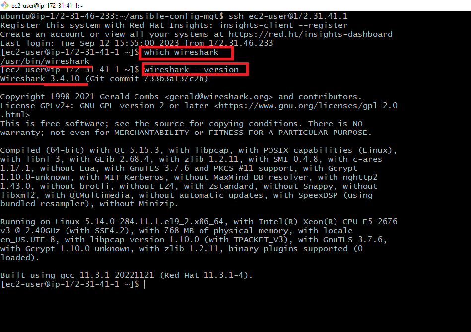

# **ANSIBLE CONFIGURATION MANAGEMENT**

**TASK**

* Install and configure Ansible client to act as a Jump Server/Bastion Host.

*	Create a simple Ansible playbook to automate servers configuration

## STEP 1 - INSTALL AND CONFIGURE ANSIBLE ON EC2 INSTANCE

1. Update Name tag on your Jenkins EC2 Instance to `Jenkins-Ansible`. We will use this server to run playbooks.

2. In your GitHub account, create a new repository and name it ansible-config-mgt.


3. Install Ansible

```bash
sudo apt update

sudo apt install ansible
```


4. Configure Jenkins build job to save your repository content every time you change it – this will solidify your Jenkins configuration skills acquired in Project 9.

* Create a new Freestyle project ansible in Jenkins and point it to your ‘ansible-config-mgt’ repository.


* Configure Webhook in GitHub and set webhook to trigger ansible build.


* Configure a Post-build job to save all (**) files, like you did it in Project 9.


5. Test your setup by making some change in README.md file in master branch and make sure that builds starts automatically and Jenkins saves the files (build artifacts) in following folder
`ls /var/lib/jenkins/jobs/ansible/builds/<build-number>/archive/`


Now your setup will look like this:


## Step 2 – PREPARE YOUR DEVELOPMENT ENVIRONMENT USING VISUAL STUDIO CODE

1. First part of ‘DevOps’ is ‘Dev’, which means you will require to write some codes and you shall have proper tools that will make your coding and debugging comfortable – you need an Integrated development environment (IDE) or Source-code Editor. There is a plethora of different IDEs and Source-code Editors for different languages with their own advantages and drawbacks, you can choose whichever you are comfortable with, but we recommend one free and universal editor that will fully satisfy your needs – Visual Studio Code (VSC), you can get it here.

2. After you have successfully installed VSC, configure it to connect to your newly created GitHub repository.

3. Clone down your ansible-config-mgt repo to your Jenkins-Ansible instance
`git clone <ansible-config-mgt repo link>`


## STEP 3 - BEGIN ANSIBLE DEVELOPMENT

1. In your ansible-config-mgt GitHub repository, create a new branch that will be used for development of a new feature.

**Tip:** Give your branches descriptive and comprehensive names, for example, if you use Jira or Trello as a project management tool – include ticket number (e.g. PRJ-145) in the name of your branch and add a topic and a brief description what this branch is about – a bugfix, hotfix, feature, release (e.g. feature/prj-145-lvm)

2. Checkout the newly created feature branch to your local machine and start building your code and directory structure

3. Create a directory and name it playbooks – it will be used to store all your playbook files.

4.	Create a directory and name it inventory – it will be used to keep your hosts organized.

5.	Within the playbooks folder, create your first playbook, and name it common.yml

6.	Within the inventory folder, create an inventory file (.yml) for each environment (Development, Staging Testing and Production) dev, staging, uat, and prod respectively.


## STEP 4 – SET UP AN ANSIBLE INVENTORY

An Ansible inventory file defines the hosts and groups of hosts upon which commands, modules, and tasks in a playbook operate. Since our intention is to execute Linux commands on remote hosts, and ensure that it is the intended configuration on a particular server that occurs. It is important to have a way to organize our hosts in such an Inventory.

Save below inventory structure in the inventory/dev file to start configuring your development servers. Ensure to replace the IP addresses according to your own setup.

**Note:** Ansible uses TCP port 22 by default, which means it needs to ssh into target servers from Jenkins-Ansible host – for this you can implement the concept of ssh-agent. Now you need to import your key into ssh-agent on your local machine:

```bash
eval `ssh-agent -s`
ssh-add <path-to-private-key>

```


SSH into the Jenkins-Ansible server with the command

```bash
ssh -A ubuntu@<Public-IP Address>
```

Confirm the key has been added with the command below, you should see the name of your key

```bash
ssh-add -l
```


Also notice, that your Load Balancer user is ubuntu and user for RHEL-based servers is ec2-user.
Update your `inventory/dev.yml` file with this snippet of code:

```bash

[nfs]
<NFS-Server-Private-IP-Address> ansible_ssh_user='ec2-user'

[webservers]
<Web-Server1-Private-IP-Address> ansible_ssh_user='ec2-user'
<Web-Server2-Private-IP-Address> ansible_ssh_user='ec2-user'

[db]
<Database-Private-IP-Address> ansible_ssh_user='ec2-user' 

[lb]
<Load-Balancer-Private-IP-Address> ansible_ssh_user='ubuntu'

```


## **Step 5 – CREATE A COMMON PLAYBOOK**

It is time to start giving Ansible the instructions on what you needs to be performed on all servers listed in `inventory/dev`.

In `common.yml` playbook you will write configuration for repeatable, re-usable, and multi-machine tasks that is common to systems within the infrastructure.

Update your `playbooks/common.yml` file with following code:

```bash

---
- name: update web, nfs and db servers
  hosts: webservers, nfs, db
  remote_user: ec2-user
  become: yes
  become_user: root
  tasks:
    - name: ensure wireshark is at the latest version
      yum:
        name: wireshark
        state: latest

- name: update LB server
  hosts: lb
  remote_user: ubuntu
  become: yes
  become_user: root
  tasks:
    - name: Update apt repo
      apt: 
        update_cache: yes

    - name: ensure wireshark is at the latest version
      apt:
        name: wireshark
        state: latest

```


This playbook is divided into two parts, each of them is intended to perform the same task: 

* install wireshark utility (or make sure it is updated to the latest version) on your RHEL 8 and Ubuntu servers.

* It uses root user to perform this task and respective package manager: yum for RHEL 8 and apt for Ubuntu.

## **STEP 6 – UPDATE GIT WITH THE LATEST CODE**

Now all of your directories and files live on your machine and you need to push changes made locally to GitHub.

Commit your code into GitHub:

1. Use git commands to add, commit and push your branch to GitHub.

```bash

git status

git add <selected files>

git commit -m "commit message"
```

2. Create a Pull request (PR)

3. Wear a hat of another developer for a second, and act as a reviewer.

4.	If the reviewer is happy with your new feature development, merge the code to the master branch.

5.	Head back on your terminal, checkout from the feature branch into the master, and pull down the latest changes.





Once your code changes appear in master branch – Jenkins will do its job and save all the files (build artifacts) to
 `/var/lib/jenkins/jobs/ansible/builds/<build_number>/archive/ directory on Jenkins-Ansible server`


## RUN FIRST ANSIBLE TEST

## Step 7 – RUN FIRST ANSIBLE TEST

Now, it is time to execute ansible-playbook command and verify if your playbook actually works:

Connect with your Jenkins-Ansible server

```bash
cd ansible-config-mgt

ansible-playbook -i inventory/dev.yml playbooks/common.yml
```


You can go to each of the servers and check if wireshark has been installed by running which 

```bash
wireshark 
```

or

```bash
wireshark --version
```





