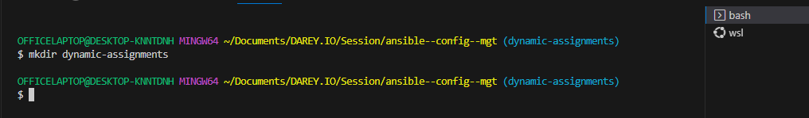
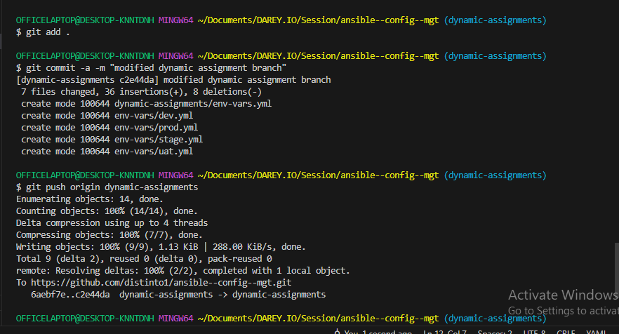

# **ANSIBLE DYNAMIC ASSIGNMENTS (INCLUDE) AND COMMUNITY ROLES**

## INTRODUCING DYNAMIC ASSIGNMENT INTO OUR STRUCTURE

In this project we will introduce dynamic assignments by using include module.

Now you may be wondering, what is the difference between static and dynamic assignments?
Well, from Project 12, you can already tell that static assignments uses the `import` Ansible module. The module that enables dynamic assignments is called  `include`.

Hence,

`import = Static`

`include = Dynamic`

When the import module is used, all statements are pre-processed at the time playbooks are parsed. Meaning, when you execute site.yml playbook, Ansible will process all the playbooks referenced during the time it is parsing the statements. This also means that, during actual execution, if any statement changes, such statements will not be considered. Hence, it is static.

On the other hand, when include module is used; all statements are processed only during execution of the playbook. Meaning, after the statements are parsed, any changes to the statements encountered during execution will be used.

## PROJECT STEPS

1. In your `https://github.com/<your-name>/ansible-config-mgt` GitHub repository start a new branch and call it `dynamic-assignments.`


2. Create a new folder, name it `dynamic-assignments.` Then inside this folder, create a new file and name it `env-vars.yml.` We will instruct site.yml to include this playbook later. For now, let us keep building up the structure.




Your GitHub shall have following structure by now.

```
├── dynamic-assignments
│   └── env-vars.yml
├── inventory
│   └── dev
    └── stage
    └── uat
    └── prod
└── playbooks
    └── site.yml
└── roles (optional folder)
    └──...(optional subfolders & files)
└── static-assignments
    └── common.yml
```


Since we will be using the same Ansible to configure multiple environments, and each of these environments will have certain unique attributes, such as servername, ip-address etc., we will need a way to set values to variables per specific environment.

For this reason, we will now create a folder to keep each environment’s variables file. Therefore, create a new folder env-vars, then for each environment, create new YAML files which we will use to set variables.


Your layout should now look like this.

```
├── dynamic-assignments
│   └── env-vars.yml
├── env-vars
    └── dev.yml
    └── stage.yml
    └── uat.yml
    └── prod.yml
├── inventory
    └── dev
    └── stage
    └── uat
    └── prod
├── playbooks
    └── site.yml
└── static-assignments
    └── common.yml
    └── webservers.yml
```


Now paste the instruction below into the env-vars.yml file.

```
---
- name: collate variables from env specific file, if it exists
  hosts: all
  tasks:
    - name: looping through list of available files
      include_vars: "{{ item }}"
      with_first_found:
        - files:
            - dev.yml
            - stage.yml
            - prod.yml
            - uat.yml
          paths:
            - "{{ playbook_dir }}/../env-vars"
      tags:
        - always
```


## UPDATE SITE.YML WITH DYNAMIC ASSIGNMENTS

Update site.yml with dynamic assignments

Update `site.yml` file to make use of the dynamic assignment. (At this point, we cannot test it yet. We are just setting the stage for what is yet to come. So hang on to your hats)

site.yml should now look like this.

```
---
- hosts: all
- name: Include dynamic variables 
  tasks:
  import_playbook: ../static-assignments/common.yml 
  include: ../dynamic-assignments/env-vars.yml
  tags:
    - always

-  hosts: webservers
- name: Webserver assignment
  import_playbook: ../static-assignments/webservers.yml

```





## Community Roles

Now it is time to create a role for MySQL database – it should install the MySQL package, create a database and configure users. But why should we re-invent the wheel? There are tons of roles that have already been developed by other open source engineers out there. These roles are actually production ready, and dynamic to accomodate most of Linux flavours. With Ansible Galaxy again, we can simply download a ready to use ansible role, and keep going.

Download Mysql Ansible Role

We will be using a MySQL role developed by geerlingguy

Inside `roles` directory create your new MySQL role with `ansible-galaxy install geerlingguy.mysql -p .` and rename the folder to `mysql`

```
cd roles

sudo ansible-galaxy install geerlingguy.mysql
```


```
mv geerlingguy.mysql/ mysql
```


configure the database credentials for mysql


remember to configure instructions that will enable the playbook for database to run in `db.yml`.


Let's run the playbook to test for mysql


Inside `roles` directory create your new Nginx role with `ansible-galaxy install geerlingguy.nginx -p /home/ubuntu/ansible--config--mgt/roles` and rename the folder to `nginx-lb`

```
sudo ansible-galaxy install geerlingguy.nginx -p /home/ubuntu/ansible--config--mgt/roles

mv geerlingguy.nginx/ nginx-lb

```


Inside `roles` directory create your new Apache role with `ansible-galaxy install geerlingguy.apache -p  /home/ubuntu/ansible--config--mgt/roles` and rename the folder to `apacheRole`

```
ansible-galaxy install geerlingguy.apache -p /home/ubuntu/ansible--config--mgt/roles

mv geerlingguy.apache/ apache-lb

```


## LOAD BALANCER ROLES

We want to be able to choose which Load Balancer to use, Nginx or Apache, so we need to have two roles respectively:

1. Nginx
   
2. Apache

## **Important Hints:**

* Since you cannot use both **Nginx** and **Apache** load balancer, you need to add a condition to enable either one – this is where you can make use of variables.

* Declare a variable in `defaults/main.yml` file inside the Nginx and Apache roles. Name each variables `enable_nginx_lb` and `enable_apache_lb` respectively.

* Set both values to false like this `enable_nginx_lb: false` and `enable_apache_lb: false`.

* Declare another variable in both roles `load_balancer_is_required` and set its value to `false` as well

* Update both assignment and site.yml files respectively

`loadbalancers.yml` file

```
- hosts: lb
  roles:
    - { role: nginx, when: enable_nginx_lb and load_balancer_is_required }
    - { role: apache, when: enable_apache_lb and load_balancer_is_required }
```

`site.yml` file

```

     - name: Loadbalancers assignment
       hosts: lb
         - import_playbook: ../static-assignments/loadbalancers.yml
        when: load_balancer_is_required
```

Now you can make use of `env-vars\uat.yml` file to define which loadbalancer to use in UAT environment by setting respective environmental variable to `true`.

You will activate load balancer, and enable `nginx` by setting these in the respective environment’s env-vars file.

```
enable_apache_lb: true
load_balancer_is_required: true
```

The same must work with `nginx` LB, so you can switch it by setting respective environmental variable to `true` and other to `false`.


Run Playbook using:

```
ansible-playbook -i inventory/uat.yml playbooks/site.yml
```

Configure the settings on the Apache server role


Enable Apache to be the preferred load balancer


Run the playbook


